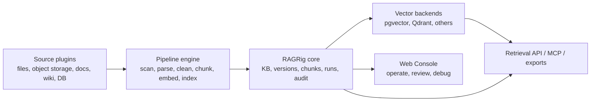

<p align="center">
  
</p>

<h1 align="center">RAGRig</h1>

<p align="center">
  <strong>Open-source RAG governance and pipeline platform for enterprise knowledge.</strong>
</p>

<p align="center">
  <em>源栈: from scattered enterprise sources to traceable, permission-aware, model-ready knowledge.</em>
</p>

<p align="center">
  <a href="./README.zh-CN.md">中文</a>
</p>

---

## About

RAGRig is an open-source platform for building lightweight, governable RAG systems for small and medium-sized teams.

It helps organizations connect scattered knowledge sources, clean and structure documents with LLM-assisted pipelines, index them into vector stores such as Qdrant and pgvector, and serve retrieval results through traceable, permission-aware APIs.

RAGRig is not meant to be another generic chatbot wrapper. Its focus is the hard operational layer around RAG:

- source connectors for documents, wikis, shared drives, databases, object storage, and enterprise document hubs
- customizable ingestion and cleaning workflows
- model registry for LLMs, embedding models, rerankers, OCR, and parsers
- Qdrant and Postgres/pgvector as first-class vector backends
- document, chunk, and metadata versioning
- permission-aware retrieval with pre-retrieval access filtering
- RAG evaluation, observability, and regression checks
- source traceability from answer to document, version, chunk, and pipeline run
- Markdown and document preview/editing integrations for knowledge review workflows

The goal is to make enterprise knowledge usable by AI systems without losing control over source provenance, permissions, quality, or deployment cost.

## Why RAGRig

Many RAG tools make it easy to upload files and chat with them. Production RAG inside a company needs more than that.

Teams need to know where each answer came from, whether the source is still valid, which model created the embedding, who is allowed to retrieve the content, and whether a pipeline change made retrieval better or worse.

RAGRig treats RAG as an operational system:

- **Source-first:** every generated answer should point back to inspectable source material.
- **Governed by default:** access control, metadata, versions, and audit events are part of the core model.
- **Model-flexible:** bring local or hosted LLMs, embedding models, rerankers, OCR, and parsers.
- **Local-first:** prefer local files, pgvector, Ollama, LM Studio, BGE, and self-hosted runtimes before cloud services.
- **Vector-store portable:** start with pgvector, scale to Qdrant, and keep migration paths explicit.
- **Ops-friendly:** designed for Docker Compose first, with a path to Kubernetes later.
- **Plugin-first:** keep the core small, then extend sources, sinks, models, vector stores, preview tools, and workflow nodes through explicit contracts.
- **Quality-gated:** core modules must reach and maintain 100% test coverage, with cloud and enterprise plugins covered through contract tests.

## Architecture



## Project Status

RAGRig is in early project design and scaffolding.

Current implementation status:

1. Phase 0 docs and project framing are committed.
2. Phase 1a scaffold provides a FastAPI service, local Docker Compose stack, pgvector-enabled PostgreSQL, and verification commands.
3. Phase 1a metadata DB adds SQLAlchemy models, Alembic migrations, and DB smoke commands for the MVP metadata boundary.
4. Phase 1b now supports local Markdown/Text ingestion into the metadata DB, including `document_versions` and pipeline-run tracking.
5. Phase 1c now supports deterministic local chunking and embedding into `chunks` and `embeddings` for the latest ingested document versions.
6. Phase 1d now supports a minimal retrieval API and smoke CLI over the real indexed chunks and embeddings.
7. Phase 1e PR-1 now adds a core provider registry contract and registers `deterministic-local` through it.
8. Phase 1e PR-2 now adds local provider adapters for Ollama, LM Studio, OpenAI-compatible local runtimes, and optional BGE boundaries without changing the default secret-free test path.
9. Phase 1e PR-3 now adds cloud-second provider stubs for Vertex AI, Bedrock, Azure OpenAI, OpenRouter, OpenAI, Cohere, Voyage, and Jina through the same registry and discovery surfaces.
10. `source.s3` now supports real S3-compatible Markdown/Text ingestion with fake-client-first tests and opt-in runtime dependencies.
11. `source.fileshare` now supports offline-tested SMB, mounted NFS/local path, WebDAV, and SFTP ingestion contracts with truthful readiness, delete-detection placeholders, and an explicit `make fileshare-check` smoke path.
12. Semantic production embeddings, live local runtime smoke checks, production cloud adapters, reranking, and richer source types remain intentionally limited or deferred in this repository state.

Authoritative specs:

- [MVP spec](./docs/specs/ragrig-mvp-spec.md)
- [Phase 1a scaffold spec](./docs/specs/ragrig-phase-1a-scaffold-spec.md)
- [Phase 1a metadata DB spec](./docs/specs/ragrig-phase-1a-metadata-db-spec.md)
- [Phase 1b local ingestion spec](./docs/specs/ragrig-phase-1b-local-ingestion-spec.md)
- [Phase 1c chunking and embedding spec](./docs/specs/ragrig-phase-1c-chunking-embedding-spec.md)
- [Phase 1d retrieval API spec](./docs/specs/ragrig-phase-1d-retrieval-api-spec.md)
- [Phase 1e local model provider plugin spec](./docs/specs/ragrig-phase-1e-local-model-provider-plugin-spec.md)
- [GitHub CI checks spec](./docs/specs/ragrig-github-ci-checks-spec.md)
- [Web Console spec](./docs/specs/ragrig-web-console-spec.md)
- [Vector backend status console spec](./docs/specs/ragrig-vector-backend-status-console-spec.md)
- [Local-first, quality, and supply chain policy](./docs/specs/ragrig-local-first-quality-supply-chain-policy.md)
- [Core coverage and supply chain gates](./docs/specs/ragrig-core-coverage-supply-chain-gates.md)
- [Web Console prototype](./docs/prototypes/web-console/index.html)

## Web Console

RAGRig now ships a first lightweight Web Console inside the same FastAPI service. It is an operator workbench for knowledge bases, sources, ingestion tasks, pipeline runs, document and chunk review, retrieval debugging, model shells, and health status.

The console lives at:

```text
GET /console
```

What the current MVP covers:

- knowledge base inventory from the real DB
- local-directory source configuration from the real DB
- CLI-connected ingestion entry with disabled browser-write state
- pipeline run history and per-item detail from the real DB
- document latest-version preview and real chunk preview or empty state
- retrieval Playground backed by the real `POST /retrieval/search` contract
- embedding profile inventory from indexed chunks
- health, DB dialect, Alembic revision, extension state, and visible tables
- vector backend readiness with backend type, dependency state, collection rows, and score semantics

Current limitations:

- browser-triggered create/update actions are intentionally not implemented yet
- model registry remains read-only, but now exposes local LLM and reranker registry shells for PR-2 providers
- provider registry metadata is exposed read-only, including Ollama, LM Studio, OpenAI-compatible local runtimes, and optional BGE boundaries
- the console only shows capabilities backed by existing DB/API boundaries and uses empty, disabled, or degraded states for the rest
- qdrant remains optional; missing `qdrant-client` or missing live collections degrade only the vector panel instead of the whole console

<p align="center">
  
</p>

## Phase 1a Foundation

Phase 1a currently ships the engineering scaffold and metadata database foundation required for follow-on ingestion and retrieval work:

- Python 3.11+ service with FastAPI
- typed settings via `pydantic-settings`
- `GET /health` with explicit app and database status
- SQLAlchemy 2.x models for the metadata boundary from MVP Section 12
- Alembic migrations rooted at `alembic/`
- pgvector-backed `embeddings` table with dynamic dimensions metadata
- `uv`-managed dependencies in `pyproject.toml`
- `ruff` format/lint commands and `pytest` tests
- Docker Compose for the app and PostgreSQL with pgvector
- smoke commands for migration and schema validation

Phase 1b, Phase 1c, and Phase 1d add these implemented boundaries:

- `src/ragrig/ingestion`
- `src/ragrig/parsers`
- `src/ragrig/repositories`
- `src/ragrig/chunkers`
- `src/ragrig/embeddings`
- `src/ragrig/indexing`
- `src/ragrig/retrieval.py`

Still reserved for later phases:

- `src/ragrig/cleaners`
- `src/ragrig/vectorstore`

The current repository state supports local Markdown/Text parsing, character-window chunking, deterministic local embeddings, a provider registry core contract, and a minimal pgvector-backed retrieval API for smoke validation. Production embedding providers, reranking, and answer generation are still deferred.

## Provider Registry

Phase 1e PR-1 establishes the core provider registry contract in `src/ragrig/providers/`.

What exists now:

- provider metadata and capability declarations
- register/get/read/list/health-check registry operations
- structured provider errors for missing providers and unsupported capabilities
- deterministic-local registered as the built-in embedding provider for CI and smoke flows
- read-only provider inventory in `GET /models`

PR-2 additions:

- `model.ollama` local adapter metadata and fake-client contract tests
- `model.lm_studio` local OpenAI-compatible adapter metadata and fake-client contract tests
- shared local adapter declarations for `model.llama_cpp`, `model.vllm`, `model.xinference`, and `model.localai`
- `embedding.bge` and `reranker.bge` provider boundaries with lazy optional dependency loading
- read-only `/models` and `/plugins` visibility for the above providers

PR-3 additions:

- `model.vertex_ai`, `model.bedrock`, `model.azure_openai`, `model.openrouter`, `model.openai`, `model.cohere`, `model.voyage`, and `model.jina` registry metadata
- cloud-second plugin discovery entries in `/plugins` and `make plugins-check`
- optional cloud dependency groups in `pyproject.toml` without changing the default install path
- read-only `/models` visibility for the cloud stubs, including required secret and config metadata

What is still deferred:

- no production cloud API calls in this PR slice
- no DB-backed model profile management
- no default live local or cloud runtime smoke in `make test`

`deterministic-local` remains a secret-free, network-free test and smoke provider. It is not a production semantic embedding model.

## Local Provider Extras

PR-2 keeps local runtime SDKs and heavy ML packages out of the default install.

Install optional local runtime support with:

```bash
uv sync --extra local-ml --dev
```

The `local-ml` extra currently groups:

- `ollama`
- `openai`
- `FlagEmbedding`
- `sentence-transformers`
- `torch`

Default tests still use fake clients and optional-dependency-safe loaders. A fresh clone does not need Ollama, LM Studio, GPUs, or local model downloads.

## Cloud Provider Extras

PR-3 keeps cloud SDKs out of the default install and ships only contract-first cloud stubs.

Optional cloud dependency groups:

- `cloud-google`: `google-cloud-aiplatform`
- `cloud-aws`: `boto3`
- `cloud-openai`: `openai`
- `cloud-cohere`: `cohere`
- `cloud-voyage`: `voyageai`
- `cloud-jina`: no SDK package yet; the stub documents an `httpx`-style API boundary only

Example installs:

```bash
uv sync --extra cloud-openai --extra cloud-google --dev
uv sync --extra cloud-aws --extra cloud-cohere --dev
```

PR-3 cloud stubs are intentionally contract-only:

- no live cloud API calls in default tests
- no real API keys required for fresh clone verification
- `/models`, `/plugins`, and `make plugins-check` expose metadata, secret requirements, and current stub status only
- production cloud adapters should land in follow-up PRs, not inside this stub/docs slice

Default local endpoints documented by PR-2:

- `model.ollama`: `http://localhost:11434`
- `model.lm_studio`: `http://localhost:1234/v1`
- `model.llama_cpp`: `http://localhost:8080/v1`
- `model.vllm`: `http://localhost:8000/v1`
- `model.xinference`: `http://localhost:9997/v1`
- `model.localai`: `http://localhost:8080/v1`

## Quick Start

1. Install `uv` if it is not already available.
2. Sync dependencies:

   ```bash
   make sync
   ```

3. Create a local env file:

   ```bash
   cp .env.example .env
   ```

   If `8000` or `5432` are already in use on the host, set alternate values in `.env`, for example `APP_HOST_PORT=18000` or `DB_HOST_PORT=15433`.

4. Run code quality checks:

   ```bash
   make format
   make lint
   make test
   make coverage
   make dependency-inventory
   ```

5. Run supply-chain checks:

   ```bash
   make licenses
   make sbom
   make audit
   ```

   `make audit` requires network access. If the environment is offline, use `make audit-dry-run` and treat the vulnerability audit as blocked rather than silently skipped.

6. Start the database service:

   ```bash
   docker compose up --build -d db
   ```

7. Run the initial migration:

   ```bash
   make migrate
   ```

8. Verify the extension and schema:

   ```bash
   make db-check
   ```

   Expected output shape:

   ```json
   {
     "current_revision": "20260503_0001",
     "extension": "vector",
     "missing_tables": [],
     "present_tables": [
       "chunks",
       "document_versions",
       "documents",
       "embeddings",
       "knowledge_bases",
       "pipeline_run_items",
       "pipeline_runs",
       "sources"
     ],
     "revision_matches_head": true
   }
   ```

9. Preview the local ingestion fixture without writing to the database:

   ```bash
   make ingest-local-dry-run
   ```

10. Ingest the local Markdown/Text fixture into the database:

   ```bash
   make ingest-local
   ```

11. Query the latest local-ingestion run summary:

   ```bash
   make ingest-check
   ```

   Expected output shape:

   ```json
   {
     "counts": {
       "document_versions": 4,
       "documents": 5,
       "pipeline_run_items": 5,
       "sources": 1
     },
     "knowledge_base": {
       "name": "fixture-local"
     },
     "latest_pipeline_run": {
       "failure_count": 0,
       "status": "completed",
       "success_count": 4,
       "total_items": 5
     }
   }
   ```

12. Chunk and embed the latest ingested document versions:

    ```bash
    make index-local
    ```

13. Query the latest chunking and embedding run summary:

    ```bash
    make index-check
    ```

    Expected output shape:

    ```json
    {
      "counts": {
        "chunks": 4,
        "embeddings": 4
      },
      "embedding_dimensions": [
        {
          "count": 4,
          "dimensions": 8,
          "model": "hash-8d",
          "provider": "deterministic-local"
        }
      ],
      "latest_pipeline_run": {
        "failure_count": 0,
        "status": "completed",
        "success_count": 3,
        "total_items": 4
      }
     }
     ```

14. Run a retrieval smoke query against the indexed chunks:

    ```bash
    make retrieve-check QUERY="RAGRig Guide"
    ```

    Expected output shape:

    ```json
    {
      "dimensions": 8,
      "distance_metric": "cosine_distance",
      "knowledge_base": "fixture-local",
      "model": "hash-8d",
      "provider": "deterministic-local",
      "query": "RAGRig Guide",
      "results": [
        {
          "chunk_id": "...",
          "chunk_index": 0,
          "document_id": "...",
          "document_uri": ".../guide.md",
          "document_version_id": "...",
          "distance": 0.0,
          "score": 1.0,
          "source_uri": ".../tests/fixtures/local_ingestion",
          "text_preview": "# RAGRig Guide ..."
        }
      ],
      "top_k": 3,
      "total_results": 1
     }
     ```

     The default path uses `VECTOR_BACKEND=pgvector`. If you explicitly enable Qdrant, the
     response shape stays the same and adds backend metadata:

     ```json
     {
       "backend": "qdrant",
       "backend_metadata": {
         "distance_metric": "cosine",
         "status": "ready"
       }
     }
     ```

 15. Start optional local Qdrant only when you want the alternate backend smoke path:

     ```bash
     docker compose --profile qdrant up -d qdrant
     uv sync --extra vectorstores
     VECTOR_BACKEND=qdrant make index-local
     VECTOR_BACKEND=qdrant make retrieve-check QUERY="RAGRig Guide"
     ```

      `qdrant-client` is intentionally optional. Fresh clone `make test` and `make coverage`
      continue to pass without the package or a running Qdrant container.

 16. Inspect plugin readiness offline:

     ```bash
     make plugins-check
     ```

     `source.s3` reports `unavailable` until you install the optional S3 SDK:

     ```bash
     uv sync --extra s3
     ```

 17. Run the opt-in S3-compatible smoke path against MinIO or another S3-compatible endpoint:

     ```bash
     docker compose --profile minio up -d minio
     uv sync --extra s3
     make s3-check
     ```

     The default `.env.example` values target the local MinIO profile. `make s3-check` seeds
     `tests/fixtures/local_ingestion/` into the configured bucket before ingesting it.

     Minimal runtime config uses declared secret refs only:

     ```json
     {
       "bucket": "ragrig-smoke",
       "prefix": "ragrig-smoke",
       "endpoint_url": "http://127.0.0.1:9000",
       "region": "us-east-1",
       "use_path_style": true,
       "verify_tls": false,
       "access_key": "env:AWS_ACCESS_KEY_ID",
       "secret_key": "env:AWS_SECRET_ACCESS_KEY",
       "session_token": "env:AWS_SESSION_TOKEN"
     }
     ```

     Current `source.s3` limits:

     - only Markdown and plain-text objects are parsed
     - unsupported extensions, binary objects, and oversized objects are skipped with recorded reasons
     - delete detection, tombstones, and standalone cursor state are not implemented yet

 18. Start the local API service, including the Web Console:

    ```bash
    make run-web
    ```

    Then open `http://localhost:8000/console`.

    If you changed `APP_HOST_PORT`, open that port instead.

 19. Run the Web Console smoke contract:

    ```bash
    make web-check
    ```

 20. Start the full local development stack when you also want Docker-managed app + DB:

    ```bash
    docker compose up --build
    ```

 21. Verify the service and pgvector bootstrap:

    ```bash
    curl http://localhost:8000/health
    docker compose exec db psql -U ragrig -d ragrig -c "SELECT extname FROM pg_extension WHERE extname = 'vector';"
    docker compose exec db psql -U ragrig -d ragrig -c "SELECT tablename FROM pg_tables WHERE schemaname = 'public' ORDER BY tablename;"
    ```

    If you changed `APP_HOST_PORT`, use that port in the `curl` command.
    If you changed `DB_HOST_PORT`, keep using `docker compose exec db ...`; no command change is required.

Expected healthy response:

```json
{
  "status": "healthy",
  "app": "ok",
  "db": "connected",
  "version": "0.1.0"
}
```

If PostgreSQL is unavailable, `/health` returns `503` with a clear error payload.

19. Exercise the retrieval API directly:

    ```bash
    curl -X POST http://localhost:8000/retrieval/search \
      -H "Content-Type: application/json" \
      -d '{"knowledge_base":"fixture-local","query":"RAGRig Guide","top_k":1}'
    ```

    If you changed `APP_HOST_PORT`, use that port in the request URL.

## Database Commands

Repository-level DB commands:

- `make migrate`: apply Alembic migrations to head
- `make migrate-down`: roll back one migration step
- `make db-check`: verify `pgvector` extension, required Phase 1a tables, and Alembic head revision
- `make db-shell`: open `psql` in the Compose database container
- `make test-db`: alias for the DB smoke check
- `make web-check`: verify `/console` and the Web Console data routes
- `make ingest-local-dry-run`: preview scanned files and skip reasons without DB writes
- `make ingest-local`: ingest the local fixture corpus or an overridden root path into the metadata DB
- `make ingest-check`: query the latest local-ingestion run and document-version evidence
- `make index-local`: chunk and embed the latest ingested document versions for the chosen knowledge base
- `make index-check`: query the latest chunk and embedding run, counts, spans, and embedding dimensions
- `make retrieve-check QUERY="..."`: query the indexed chunks and print top-k citation fields

Fresh-clone schema verification path:

```bash
make sync
cp .env.example .env
docker compose up --build -d db
make migrate
make db-check
```

The Compose file still supports shared-machine port overrides through `.env`, for example:

```bash
APP_HOST_PORT=18000
DB_HOST_PORT=15433
```

This override path must remain available for `192.168.3.100` and other shared hosts where default ports are already in use.

Host-side migration and smoke commands (`make migrate`, `make db-check`) connect through `localhost:${DB_HOST_PORT}` so they work from the machine that launched Docker Compose, even though the application container still uses `DATABASE_URL=postgresql://ragrig:ragrig_dev@db:5432/ragrig` internally.

The same host-side runtime URL rule also applies to `make ingest-local` and `make ingest-check`, so shared-host verification can use alternate mapped DB ports without rewriting the app container path.

## Local Ingestion

Phase 1b currently implements the smallest reproducible local ingestion loop for Markdown and plain text files.

What it does:

- scans an explicit local root path
- applies include and exclude glob filters
- skips excluded, oversized, unsupported, and binary files with recorded reasons
- parses UTF-8 Markdown and text files
- computes SHA-256 file hashes
- writes `sources`, `documents`, `document_versions`, `pipeline_runs`, and `pipeline_run_items`
- avoids duplicate `document_versions` when the file content hash has not changed

What it does not do yet:

- chunking
- embeddings or pgvector writes
- deletion cleanup or tombstones

Default fixture path:

```bash
tests/fixtures/local_ingestion
```

Custom run example:

```bash
uv run python -m scripts.ingest_local \
  --knowledge-base demo \
  --root-path tests/fixtures/local_ingestion \
  --include "*.md" \
  --include "*.txt" \
  --exclude "nested/*"
```

Dry-run example:

```bash
uv run python -m scripts.ingest_local \
  --knowledge-base demo \
  --root-path tests/fixtures/local_ingestion \
  --dry-run
```

## Retrieval API

Phase 1d implements the smallest retrieval boundary on top of Phase 1c indexed chunks.

What it does:

- embeds query text with the same deterministic-local provider used for default indexing smoke runs
- searches only the latest `document_versions` rows per document
- returns top-k chunk matches with `document_id`, `document_version_id`, `chunk_id`, `chunk_index`, `document_uri`, `source_uri`, `distance`, `score`, and `chunk_metadata`
- exposes both `POST /retrieval/search` and `make retrieve-check`

What it does not do yet:

- answer generation
- reranking or lexical fallback
- ACL filtering
- external embedding providers as the default path

## Web Console Usage

The Web Console is served by the same FastAPI process as `/health`, `/docs`, and `/retrieval/search`.

Local startup sequence from a fresh clone:

```bash
make sync
cp .env.example .env
docker compose up --build -d db
make migrate
make ingest-local
make index-local
make run-web
```

Then open:

```text
http://localhost:8000/console
```

Suggested local verification sequence:

```bash
make test
make web-check
make retrieve-check QUERY="RAGRig Guide"
```

Relationship to other interfaces:

- Web Console: operator-facing overview and debugging workbench
- Swagger (`/docs`): raw API exploration
- CLI / Make targets: write-path orchestration for ingest and indexing in this MVP

The console does not invent data. If a knowledge base has no chunks, models, or retrieval results yet, the UI shows real empty or degraded states instead of placeholders.

## Plugin Architecture

RAGRig is designed as a small core with plugin-first extension points. The core owns workspace state, knowledge bases, documents, versions, chunks, embeddings, pipeline runs, metadata, access boundaries, audit events, and plugin contracts. Integrations live behind typed plugin interfaces.

The goal is not to build a plugin marketplace first. The goal is to make every integration explicit, testable, observable, and replaceable.

The README uses official platform links instead of embedding third-party logos. A visual integration gallery can be added later under `docs/` when each logo's trademark and usage rules are checked.

Provider priority is local-first, cloud-second. Local model runtimes, local embeddings,
local rerankers, and self-hosted vector stores must be usable before a user configures a
cloud account.

Plugin families:

| Family | Purpose | Examples |
| --- | --- | --- |
| Source connectors | Read enterprise knowledge from external systems | local files, SMB/NFS, S3-compatible storage, [Google Drive](https://www.google.com/drive/), [SharePoint](https://www.microsoft.com/en-us/microsoft-365/sharepoint/collaboration), [Confluence](https://www.atlassian.com/software/confluence), databases |
| Parsers and OCR | Convert raw files into extracted text and structure | Markdown, plain text, PDF, DOCX, XLSX, [Docling](https://github.com/docling-project/docling), [MinerU](https://github.com/opendatalab/MinerU), [Tesseract](https://github.com/tesseract-ocr/tesseract), [PaddleOCR](https://github.com/PaddlePaddle/PaddleOCR) |
| Cleaning nodes | Normalize, redact, classify, dedupe, and enrich content | deterministic cleaners, LLM-assisted cleaners, PII redaction, metadata extraction |
| Chunkers | Split document versions into traceable chunks | character windows, Markdown heading chunks, recursive text chunks, table-aware chunks |
| Model providers | Supply LLMs, embedding models, rerankers, OCR, and parsing models | local [Ollama](https://ollama.com/), [LM Studio](https://lmstudio.ai/), [vLLM](https://www.vllm.ai/), [llama.cpp](https://github.com/ggml-org/llama.cpp), [Xinference](https://inference.readthedocs.io/), [BAAI BGE](https://huggingface.co/BAAI), plus cloud [Google Vertex AI](https://cloud.google.com/vertex-ai), [Amazon Bedrock](https://aws.amazon.com/bedrock/), [OpenRouter](https://openrouter.ai/), [OpenAI](https://platform.openai.com/docs/overview), [Cohere](https://cohere.com/), [Voyage AI](https://www.voyageai.com/) |
| Vector backends | Store and search vectors with backend-specific capability reporting | [pgvector](https://github.com/pgvector/pgvector), [Qdrant](https://qdrant.tech/), [Milvus](https://milvus.io/)/[Zilliz](https://zilliz.com/), [Weaviate](https://weaviate.io/), [OpenSearch](https://opensearch.org/)/[Elasticsearch](https://www.elastic.co/), [Redis](https://redis.io/)/[Valkey](https://valkey.io/) |
| Output sinks | Write governed knowledge or retrieval artifacts elsewhere | [Amazon S3](https://aws.amazon.com/s3/)/[Cloudflare R2](https://www.cloudflare.com/developer-platform/products/r2/)/[MinIO](https://www.min.io/), NFS, relational databases, JSONL, [Parquet](https://parquet.apache.org/), Markdown, webhooks, [MCP](https://modelcontextprotocol.io/) |
| Preview/edit integrations | Let operators inspect or edit source and cleaned knowledge | Markdown editor, [WPS](https://www.wps.com/), [OnlyOffice](https://www.onlyoffice.com/), [Collabora Online](https://www.collaboraonline.com/), source-system deep links |
| Evaluation plugins | Measure retrieval and answer quality | golden questions, citation coverage, latency/cost, regression checks |
| Workflow nodes | Compose ingestion, indexing, export, and evaluation pipelines | scan, parse, clean, chunk, embed, index, retrieve, evaluate, export, notify |

### Plugin Tiers

RAGRig separates plugins by stability, priority, and maintenance ownership.

| Tier | Meaning | Ships with core | Extension policy |
| --- | --- | --- | --- |
| Built-in core plugins | Minimal local-first path required for a reproducible RAG pipeline | Yes | Maintained in this repository, no optional external service dependency |
| Official plugins | High-demand integrations maintained by the RAGRig project | Usually optional | May live in this repository first, then move to separate packages as APIs stabilize |
| Community plugins | Third-party integrations built against public contracts | No | Installed through Python packages or plugin manifests once the contract is stable |

Initial built-in core plugins:

| Plugin | Family | Read/write | Why it is core |
| --- | --- | --- | --- |
| `source.local` | Source connector | Read | Fresh-clone demo, fixture validation, shared-host smoke testing |
| `parser.markdown` | Parser | Read | Common documentation format, deterministic tests |
| `parser.text` | Parser | Read | Smallest plain-text ingestion path |
| `chunker.character_window` | Chunker | Write chunks | Reproducible chunking before semantic chunkers exist |
| `embedding.deterministic_local` | Model provider | Write embeddings | Secret-free development and CI validation |
| `vector.pgvector` | Vector backend | Read/write | Default lightweight backend on Postgres |
| `sink.jsonl` | Output sink | Write | Portable debug/export format |
| `preview.markdown` | Preview/edit | Read/write draft | Operator review without needing an office suite |

Priority official plugins:

| Priority | Plugin area | Platforms and protocols to cover first |
| --- | --- | --- |
| P0 | `vector.qdrant` | [Self-hosted Qdrant](https://qdrant.tech/documentation/) first, [Qdrant Cloud](https://qdrant.tech/cloud/) second |
| P0 | `model.local_runtime` | [Ollama](https://ollama.com/), [LM Studio](https://lmstudio.ai/), [llama.cpp](https://github.com/ggml-org/llama.cpp) server, [vLLM](https://www.vllm.ai/), [Xinference](https://inference.readthedocs.io/), [LocalAI](https://localai.io/) through official SDKs or OpenAI-compatible local APIs |
| P0 | `embedding.bge` and `reranker.bge` | [BAAI BGE](https://huggingface.co/BAAI) embedding and reranker models through local `FlagEmbedding`, `sentence-transformers`, or OpenAI-compatible serving |
| P1 | `model.cloud_provider` | [Google Vertex AI](https://cloud.google.com/vertex-ai), [Amazon Bedrock](https://aws.amazon.com/bedrock/), [OpenRouter](https://openrouter.ai/), [OpenAI](https://platform.openai.com/docs/overview), [Azure OpenAI](https://azure.microsoft.com/en-us/products/ai-services/openai-service), [Cohere](https://cohere.com/), [Voyage AI](https://www.voyageai.com/), [Jina AI](https://jina.ai/) |
| P1 | `source.s3` | [AWS S3](https://aws.amazon.com/s3/), [Cloudflare R2](https://www.cloudflare.com/developer-platform/products/r2/), [MinIO](https://www.min.io/), [Ceph RGW](https://docs.ceph.com/en/latest/radosgw/), [Wasabi](https://wasabi.com/), [Backblaze B2 S3 API](https://www.backblaze.com/cloud-storage), [Tencent COS S3 API](https://www.tencentcloud.com/products/cos), [Alibaba OSS](https://www.alibabacloud.com/product/oss) S3-compatible mode when available |
| P1 | `sink.object_storage` | [AWS S3](https://aws.amazon.com/s3/), [Cloudflare R2](https://www.cloudflare.com/developer-platform/products/r2/), [MinIO](https://www.min.io/), [Ceph RGW](https://docs.ceph.com/en/latest/radosgw/), [Wasabi](https://wasabi.com/), [Backblaze B2](https://www.backblaze.com/cloud-storage), [Google Cloud Storage](https://cloud.google.com/storage), [Azure Blob Storage](https://azure.microsoft.com/en-us/products/storage/blobs) |
| P1 | `source.fileshare` | [SMB/CIFS](https://learn.microsoft.com/en-us/windows-server/storage/file-server/file-server-smb-overview), [NFS](https://docs.kernel.org/admin-guide/nfs/index.html), [WebDAV](https://www.rfc-editor.org/rfc/rfc4918), [SFTP/OpenSSH](https://www.openssh.com/) |
| P1 | `source.google_workspace` | [Google Drive](https://www.google.com/drive/), [Google Docs](https://www.google.com/docs/about/), [Google Sheets](https://www.google.com/sheets/about/), [Google Slides](https://www.google.com/slides/about/) |
| P1 | `source.microsoft_365` | [SharePoint](https://www.microsoft.com/en-us/microsoft-365/sharepoint/collaboration), [OneDrive](https://www.microsoft.com/en-us/microsoft-365/onedrive/online-cloud-storage), [Word](https://www.microsoft.com/en-us/microsoft-365/word), [Excel](https://www.microsoft.com/en-us/microsoft-365/excel), [PowerPoint](https://www.microsoft.com/en-us/microsoft-365/powerpoint) |
| P1 | `source.wiki` | [Confluence](https://www.atlassian.com/software/confluence), [MediaWiki](https://www.mediawiki.org/wiki/MediaWiki), [GitBook](https://www.gitbook.com/), [Docusaurus](https://docusaurus.io/), [MkDocs](https://www.mkdocs.org/) |
| P1 | `source.database` | [PostgreSQL](https://www.postgresql.org/), [MySQL](https://www.mysql.com/)/[MariaDB](https://mariadb.org/), [SQL Server](https://www.microsoft.com/en-us/sql-server), [Oracle Database](https://www.oracle.com/database/), [SQLite](https://www.sqlite.org/), [MongoDB](https://www.mongodb.com/), [Elasticsearch](https://www.elastic.co/elasticsearch)/[OpenSearch](https://opensearch.org/) |
| P1 | `preview.office` | [WPS](https://www.wps.com/), [OnlyOffice](https://www.onlyoffice.com/), [Collabora Online](https://www.collaboraonline.com/) |
| P2 | `source.collaboration` | [Notion](https://www.notion.com/), [Lark](https://www.larksuite.com/)/[Feishu](https://www.feishu.cn/), [DingTalk](https://www.dingtalk.com/), [WeCom](https://work.weixin.qq.com/), [Slack files](https://slack.com/), [Microsoft Teams files](https://www.microsoft.com/en-us/microsoft-teams/group-chat-software) |
| P2 | `parser.advanced_documents` | PDF layout extraction, DOCX/PPTX/XLSX, [Docling](https://github.com/docling-project/docling), [MinerU](https://github.com/opendatalab/MinerU), [Unstructured](https://unstructured.io/) |
| P2 | `ocr` | [PaddleOCR](https://github.com/PaddlePaddle/PaddleOCR), [Tesseract](https://github.com/tesseract-ocr/tesseract), [AWS Textract](https://aws.amazon.com/textract/), [Azure Document Intelligence](https://azure.microsoft.com/en-us/products/ai-services/ai-document-intelligence), [Google Document AI](https://cloud.google.com/document-ai) |
| P2 | `vector.enterprise` | [Milvus](https://milvus.io/)/[Zilliz](https://zilliz.com/), [Weaviate](https://weaviate.io/), [OpenSearch](https://opensearch.org/)/[Elasticsearch](https://www.elastic.co/elasticsearch) vector, [Redis](https://redis.io/)/[Valkey](https://valkey.io/) vector, [Vespa](https://vespa.ai/) |
| P2 | `sink.analytics` | [Parquet](https://parquet.apache.org/), [DuckDB](https://duckdb.org/), [ClickHouse](https://clickhouse.com/), [BigQuery](https://cloud.google.com/bigquery), [Snowflake](https://www.snowflake.com/) |
| P2 | `sink.agent_access` | [MCP](https://modelcontextprotocol.io/) server, webhooks, retrieval API export adapters |

Every plugin should declare:

- plugin id, type, version, and owner
- supported read/write operations
- configuration schema
- required secrets
- secret requirements
- capability matrix
- local/cloud classification
- dimensions and context-window metadata when applicable
- SDK or protocol surface
- cursor or incremental-sync support
- delete detection support
- permission mapping support
- failure and retry behavior
- emitted metrics and audit events

Example manifest shape:

```yaml
manifest_version: 1
id: source.s3
type: source
version: 0.1.0
capabilities:
  - read
  - incremental_sync
  - delete_detection
config_model: S3SourceConfig
secret_requirements:
  - AWS_ACCESS_KEY_ID
  - AWS_SECRET_ACCESS_KEY
```

Current contract-first implementation adds:

- `src/ragrig/plugins/` for the registry, manifest schema, dependency guards, and built-in plus official stub manifests.
- `GET /plugins` for offline plugin discovery with readiness, missing dependency, configurability, and secret requirement reporting.
- `make plugins-check` for offline JSON inspection of the registry.
- `source.fileshare` as a real official source plugin with mounted-path NFS support, fake-client SMB/WebDAV/SFTP coverage, and protocol-level readiness reporting.
- `make fileshare-check` for offline mounted-path and fake remote fileshare smoke validation.

### Fileshare Source

`source.fileshare` is the current local-first bridge for enterprise shared storage.

What it supports now:

- `protocol = nfs_mounted`: mount the share through the OS, then point RAGRig at the mounted directory
- `protocol = smb`: SMB/CIFS contract, readiness reporting, fake-client tests, optional `smbprotocol` runtime dependency
- `protocol = webdav`: WebDAV contract, readiness reporting, fake-client tests, optional `httpx` runtime dependency
- `protocol = sftp`: SFTP contract, readiness reporting, fake-client tests, optional `paramiko` runtime dependency

Current boundaries:

- default `make test` and `make coverage` stay network-free and secret-free
- delete detection is a placeholder audit signal only; it records `deleted_upstream` in pipeline items but does not delete stored documents
- permission mapping is metadata-only for now; access enforcement is not implemented in this phase
- only Markdown/Text parsing goes through the existing parser path by default

Install optional runtime SDKs with:

```bash
uv sync --extra fileshare --dev
```

Offline smoke:

```bash
make fileshare-check
```

Example SMB config:

```json
{
  "protocol": "smb",
  "host": "files.example.internal",
  "share": "knowledge",
  "root_path": "/docs",
  "username": "env:FILESHARE_USERNAME",
  "password": "env:FILESHARE_PASSWORD",
  "include_patterns": ["*.md", "*.txt"],
  "exclude_patterns": [],
  "max_file_size_mb": 50,
  "page_size": 1000,
  "max_retries": 3,
  "connect_timeout_seconds": 10,
  "read_timeout_seconds": 30
}
```

Example mounted NFS/local-path config:

```json
{
  "protocol": "nfs_mounted",
  "root_path": "/mnt/company-knowledge",
  "include_patterns": ["*.md", "*.txt"],
  "exclude_patterns": [],
  "max_file_size_mb": 50,
  "page_size": 1000,
  "max_retries": 1,
  "connect_timeout_seconds": 10,
  "read_timeout_seconds": 30
}
```

Plugin development will start with internal Python interfaces. Public third-party plugin packaging should wait until the core contracts, test kit, and capability matrix are stable.

## Quality and Supply Chain

RAGRig uses a strict quality and dependency policy:

- Core modules must reach and maintain 100% test coverage.
- Default tests must not require network access, cloud accounts, or secrets.
- Provider SDKs must be official or actively maintained open-source packages whenever possible.
- Heavy or cloud-specific SDKs must live behind optional plugin extras, not the core runtime.
- `uv.lock` stays committed, and release candidates should include vulnerability checks,
  license review, and SBOM generation.

Executable commands in this repository:

- `make coverage`: enforces 100% line coverage for the hard core scope: `db`, `repositories`, `ingestion`, `parsers`, `chunkers`, `embeddings`, `indexing`, `plugins`, `retrieval.py`, `config.py`, and `health.py`.
- `make plugins-check`: prints the plugin registry discovery payload as offline JSON.
- `make export-object-storage-check`: runs an opt-in object storage export smoke command and defaults to `dry_run` unless explicitly overridden.
- `make licenses`: fails on GPL, AGPL, SSPL, or source-available third-party packages.

## Object Storage Sink

`sink.object_storage` now exports a minimal governed artifact set to S3-compatible object storage using optional `boto3`.

Current runtime-ready targets:

- AWS S3
- Cloudflare R2
- MinIO
- Ceph RGW
- Wasabi
- Backblaze B2 S3 API
- Tencent COS S3 API
- Alibaba OSS in S3-compatible mode

Contract-only targets in this phase:

- Google Cloud Storage
- Azure Blob Storage

Example config:

```json
{
  "bucket": "exports",
  "prefix": "team-a",
  "endpoint_url": "http://localhost:9000",
  "region": "us-east-1",
  "use_path_style": true,
  "verify_tls": true,
  "access_key": "env:AWS_ACCESS_KEY_ID",
  "secret_key": "env:AWS_SECRET_ACCESS_KEY",
  "session_token": "env:AWS_SESSION_TOKEN",
  "path_template": "{knowledge_base}/{run_id}/{artifact}.{format}",
  "overwrite": false,
  "dry_run": true,
  "include_markdown_summary": true,
  "object_metadata": {
    "environment": "dev"
  }
}
```

Behavior notes:

- JSONL artifacts use `application/x-ndjson`.
- Markdown summaries use `text/markdown; charset=utf-8`.
- Existing objects are skipped when `overwrite=false`.
- `dry_run=true` computes the export plan without uploading objects.
- Retrieval and evaluation exports are explicitly marked unsupported/degraded until dedicated runtimes exist.
- `make sbom`: writes a CycloneDX JSON SBOM to `docs/operations/artifacts/sbom.cyclonedx.json`.
- `make audit`: runs a vulnerability audit of the local environment and writes `docs/operations/artifacts/pip-audit.json`.
- `make dependency-inventory`: refreshes `docs/operations/dependency-inventory.md`.
- `make supply-chain-check`: runs the license check, SBOM export, and vulnerability audit together.

Hard-scope omissions are explicit rather than hidden by a broad exclude:

- `src/ragrig/main.py`: app wiring only
- `src/ragrig/web_console.py`: Web Console adapter layer, outside this issue's hard scope
- `src/ragrig/cleaners/*` and `src/ragrig/vectorstore/*`: placeholder packages with no shipped behavior

See the [local-first, quality, and supply chain policy](./docs/specs/ragrig-local-first-quality-supply-chain-policy.md) for the SDK inventory and supply chain rules.
See [core coverage and supply chain gates](./docs/specs/ragrig-core-coverage-supply-chain-gates.md), [supply chain operations](./docs/operations/supply-chain.md), and the [dependency inventory](./docs/operations/dependency-inventory.md) for the executable gate details.

## GitHub CI

RAGRig now includes a GitHub Actions baseline workflow named `RAGRig CI`, running on Python `3.11` and `3.12`.

What it covers on `pull_request` and `push` to `main`:

- frozen dependency install from `uv.lock` with `uv sync --dev --frozen`
- formatting check with `uv run ruff format --check .`
- lint with `uv run ruff check .`
- repository test suite with `make test`
- hard-scope coverage gate with `make coverage`
- Web Console smoke contract with `make web-check`

What it does not cover yet:

- shared-environment runtime validation on `192.168.3.100`
- Docker Compose deployment checks
- supply-chain, SBOM, license, or vulnerability gates that are still intentionally excluded from default GitHub CI
- any workflow that depends on secrets, cloud accounts, GPUs, Ollama, LM Studio, or model downloads

Validation boundary:

- GitHub CI proves the fresh-clone lint and test baseline inside GitHub Actions.
- Local developer validation still covers targeted repro, iterative debugging, and pre-PR confirmation.
- Shared-environment validation remains a separate requirement for issues that explicitly require `192.168.3.100` evidence.

After the first successful GitHub Actions run exists, the repository owner may still need to configure branch protection required checks in GitHub settings.

## Repository Layout

```text
.
├── alembic/
│   ├── env.py
│   └── versions/
│       └── 20260503_0001_phase_1a_metadata_schema.py
├── assets/
│   ├── ragrig-icon.png
│   └── ragrig-icon.svg
├── .github/
│   └── workflows/
│       └── ci.yml
├── docs/
│   ├── operations/
│   ├── prototypes/
│   ├── roadmap.md
│   └── specs/
│       ├── ragrig-github-ci-checks-spec.md
│       ├── ragrig-mvp-spec.md
│       ├── ragrig-phase-1a-metadata-db-spec.md
│       ├── ragrig-phase-1a-scaffold-spec.md
│       ├── ragrig-phase-1b-local-ingestion-spec.md
│       ├── ragrig-phase-1c-chunking-embedding-spec.md
│       ├── ragrig-phase-1d-retrieval-api-spec.md
│       ├── ragrig-local-first-quality-supply-chain-policy.md
│       └── ragrig-web-console-spec.md
├── scripts/
│   ├── db_check.py
│   ├── index_check.py
│   ├── index_local.py
│   ├── ingest_check.py
│   ├── ingest_local.py
│   ├── retrieve_check.py
│   └── init-db.sql
├── src/
│   └── ragrig/
│       ├── db/
│       │   ├── engine.py
│       │   ├── models/
│       │   └── session.py
│       ├── chunkers/
│       ├── cleaners/
│       ├── embeddings/
│       ├── retrieval.py
│       ├── indexing/
│       ├── ingestion/
│       ├── indexing/
│       ├── ingestion/
│       ├── parsers/
│       ├── repositories/
│       ├── vectorstore/
│       ├── config.py
│       └── main.py
├── tests/
│   ├── fixtures/
│   ├── test_alembic_sql.py
│   ├── test_db_check.py
│   ├── test_db_config.py
│   ├── test_db_models.py
│   ├── test_db_runtime_url.py
│   ├── test_db_session.py
│   ├── test_health.py
│   ├── test_indexing_pipeline.py
│   ├── test_ingestion_pipeline.py
│   ├── test_parsers.py
│   ├── test_retrieval.py
│   └── test_scanner.py
├── .env.example
├── alembic.ini
├── docker-compose.yml
├── Dockerfile
├── Makefile
├── pyproject.toml
├── CONTRIBUTING.md
├── LICENSE
├── README.md
├── README.zh-CN.md
└── SECURITY.md
```

## License

RAGRig is licensed under the Apache License 2.0. See [LICENSE](./LICENSE).
