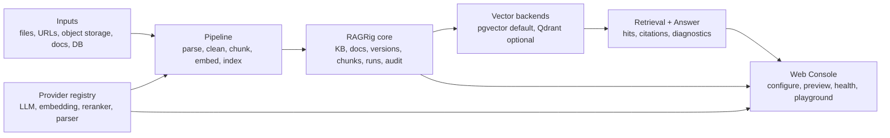

<p align="center">
  
</p>

<h1 align="center">RAGRig</h1>

<p align="center">
  <strong>Open-source RAG workbench for traceable, model-ready knowledge pipelines.</strong>
</p>

<p align="center">
  <em>源栈: from scattered sources to traceable, model-ready knowledge.</em>
</p>

<p align="center">
  <a href="./README.zh-CN.md">中文</a>
</p>

---

## About

RAGRig is an open-source RAG workbench for small and medium-sized teams.

RAGRig is not another chat-with-file wrapper. It focuses on the operational layer around RAG: ingestion, parsing, cleaning, chunking, embedding, indexing, retrieval, answer grounding, model/provider selection, evaluation, and traceability.

## Why RAGRig

- **Local-first:** start with local files, Postgres/pgvector, Ollama, LM Studio, BGE, and self-hosted OpenAI-compatible runtimes.
- **Cloud-ready:** support mainstream cloud model entry points such as OpenAI, OpenRouter, and Gemini, with Vertex AI and Bedrock tracked as roadmap/provider catalog items.
- **Traceable by design:** connect each answer back to source URI, document version, chunk, pipeline run, and model/provider diagnostics.
- **Model-flexible:** keep LLM, embedding, reranker, OCR, and parser providers behind explicit registry contracts.
- **Vector-store portable:** use Postgres/pgvector as the default and keep Qdrant as an optional backend.
- **Pipeline-oriented:** make parsing, cleaning, chunking, embedding, indexing, and reranking inspectable instead of hiding them behind a chat box.
- **Plugin-first:** extend sources, sinks, models, vector stores, parsers, preview tools, and workflow nodes without bloating the core.
- **Quality-gated:** core modules target 100% test coverage; optional cloud/enterprise integrations use contract tests and opt-in live smoke checks.

## Architecture



## Tech Stack

| Layer | Current / Default | Optional / Roadmap |
| --- | --- | --- |
| App/API | Python, FastAPI | MCP/export surfaces |
| Web Console | FastAPI-served lightweight console | richer workflow UI |
| Metadata DB | PostgreSQL | SQLite for smoke/test paths |
| Vector backend | pgvector | Qdrant |
| Local models | Ollama, LM Studio, OpenAI-compatible endpoints | vLLM, llama.cpp, Xinference, LocalAI |
| Cloud models | OpenAI, OpenRouter, Gemini | Vertex AI, Bedrock, Azure OpenAI, Anthropic catalog entries |
| Inputs | local files, Markdown/TXT, S3-compatible sources | PDF/DOCX upload, URLs, enterprise connectors |
| Quality | pytest, coverage, contract tests | opt-in live provider smoke |

## Roadmap

### Local Pilot

The next roadmap milestone is a simple local pilot. It is one step toward the broader platform, not the project positioning itself.

Target user journey:

1. Start the local stack.
2. Open the Web Console.
3. Create a knowledge base.
4. Upload Markdown, TXT, PDF, or DOCX, or import one public page, sitemap, or docs page list.
5. Choose a model provider.
6. Run ingestion and indexing.
7. Ask a question in Playground and inspect answer citations, retrieval hits, chunks, and provider diagnostics.

See [Local Pilot spec](./docs/specs/ragrig-local-pilot-spec.md) for scope and acceptance criteria.

### Later Milestones

- richer Web Console workflow management
- advanced PDF/DOCX/OCR parsing
- broader source and sink plugins
- evaluation dashboards and regression gates
- enterprise permission, audit, and connector hardening

## Web Console

The Web Console is the main operator surface for RAGRig. The intended first-run shape is:

- knowledge base list
- source setup and ingestion tasks
- model configuration and health checks
- pipeline run history
- document and chunk preview
- retrieval and answer Playground
- health and database/vector status

Prototype:

<p align="center">
  
</p>

## Quick Start

### Docker Local Pilot

Build and start the local pilot stack:

```bash
make pilot-up
make pilot-docker-smoke
```

Open:

```text
http://localhost:8000/console
```

Stop the stack:

```bash
make pilot-down
```

The Docker image does not bundle LLM weights or model runtimes. For local models,
run Ollama or LM Studio on the host and configure an OpenAI-compatible endpoint
with `RAGRIG_ANSWER_BASE_URL`. Cloud providers such as Gemini, OpenAI, and
OpenRouter are enabled by passing their API keys as environment variables.

To build only the application image:

```bash
make pilot-docker-build
```

### Developer Setup

Install dependencies:

```bash
make sync
```

Create local environment:

```bash
cp .env.example .env
```

Start the database and run migrations:

```bash
docker compose up --build -d db
make migrate
make db-check
```

Run the current local ingestion and indexing smoke path:

```bash
make ingest-local
make index-local
make retrieve-check QUERY="RAGRig Guide"
```

Run the Local Pilot API smoke:

```bash
make local-pilot-smoke
```

Start the Web Console:

```bash
make run-web
```

Open:

```text
http://localhost:8000/console
```

If ports `8000` or `5432` are already in use, update `.env`:

```bash
APP_HOST_PORT=18000
DB_HOST_PORT=15433
```

Optional Qdrant path:

```bash
docker compose --profile qdrant up -d qdrant
uv sync --extra vectorstores
VECTOR_BACKEND=qdrant make index-local
VECTOR_BACKEND=qdrant make retrieve-check QUERY="RAGRig Guide"
```

## Verification

Default checks:

```bash
make format
make lint
make test
make coverage
make web-check
make local-pilot-smoke
make dependency-inventory
```

Browser-level Local Pilot Console check:

```bash
make local-pilot-console-e2e
```

This starts an ephemeral SQLite-backed app, uploads Markdown/PDF/DOCX through the Web Console, verifies pipeline/chunk UI, and asks one grounded Playground question. It requires `npm` and a local Chrome/Chromium browser; set `RAGRIG_CONSOLE_E2E_BROWSER_CHANNEL=chromium` if Chrome is not available.

Supply-chain checks:

```bash
make licenses
make sbom
make audit
```

`make audit` needs network access to vulnerability services. Offline environments should run `make audit-dry-run` and record the missing live audit as a release blocker.

## Documentation

Key specs:

- [Local Pilot spec](./docs/specs/ragrig-local-pilot-spec.md)
- [MVP spec](./docs/specs/ragrig-mvp-spec.md)
- [Web Console spec](./docs/specs/ragrig-web-console-spec.md)
- [Plugin/source wizard spec](./docs/specs/ragrig-web-console-plugin-source-wizard-spec.md)
- [Local-first quality and supply-chain policy](./docs/specs/ragrig-local-first-quality-supply-chain-policy.md)
- [Core coverage and supply-chain gates](./docs/specs/ragrig-core-coverage-supply-chain-gates.md)

Operations:

- [Dependency inventory](./docs/operations/dependency-inventory.md)
- [Supply chain](./docs/operations/supply-chain.md)
- [Roadmap](./docs/roadmap.md)

## Repository Layout

```text
.
├── assets/             # Project icon
├── docs/               # Specs, operations docs, prototypes
├── scripts/            # Smoke, ops, and verification commands
├── src/ragrig/         # RAGRig application code
├── tests/              # Unit and contract tests
├── docker-compose.yml  # Local Postgres/pgvector and optional services
├── pyproject.toml      # Python dependencies and tooling
└── Makefile            # Common developer commands
```

## License

RAGRig is licensed under the Apache License 2.0. See [LICENSE](./LICENSE).
