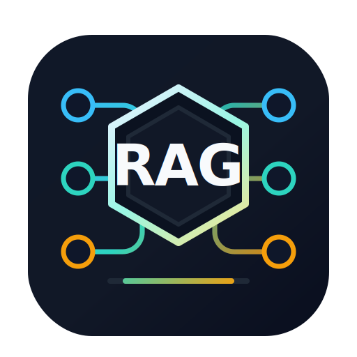

<p align="center">
  
</p>

<h1 align="center">RAGRig</h1>

<p align="center">
  <strong>Open-source RAG governance and pipeline platform for enterprise knowledge.</strong>
</p>

<p align="center">
  <em>源栈: from scattered enterprise sources to traceable, permission-aware, model-ready knowledge.</em>
</p>

---

## About

RAGRig is an open-source platform for building lightweight, governable RAG systems for small and medium-sized teams.

It helps organizations connect scattered knowledge sources, clean and structure documents with LLM-assisted pipelines, index them into vector stores such as Qdrant and pgvector, and serve retrieval results through traceable, permission-aware APIs.

RAGRig is not meant to be another generic chatbot wrapper. Its focus is the hard operational layer around RAG:

- source connectors for documents, wikis, shared drives, databases, object storage, and enterprise document hubs
- customizable ingestion and cleaning workflows
- model registry for LLMs, embedding models, rerankers, OCR, and parsers
- Qdrant and Postgres/pgvector as first-class vector backends
- document, chunk, and metadata versioning
- permission-aware retrieval with pre-retrieval access filtering
- RAG evaluation, observability, and regression checks
- source traceability from answer to document, version, chunk, and pipeline run
- Markdown and document preview/editing integrations for knowledge review workflows

The goal is to make enterprise knowledge usable by AI systems without losing control over source provenance, permissions, quality, or deployment cost.

## Why RAGRig

Many RAG tools make it easy to upload files and chat with them. Production RAG inside a company needs more than that.

Teams need to know where each answer came from, whether the source is still valid, which model created the embedding, who is allowed to retrieve the content, and whether a pipeline change made retrieval better or worse.

RAGRig treats RAG as an operational system:

- **Source-first:** every generated answer should point back to inspectable source material.
- **Governed by default:** access control, metadata, versions, and audit events are part of the core model.
- **Model-flexible:** bring local or hosted LLMs, embedding models, rerankers, OCR, and parsers.
- **Vector-store portable:** start with pgvector, scale to Qdrant, and keep migration paths explicit.
- **Ops-friendly:** designed for Docker Compose first, with a path to Kubernetes later.

## Project Status

RAGRig is in early project design and scaffolding.

Current implementation status:

1. Phase 0 docs and project framing are committed.
2. Phase 1a scaffold provides a FastAPI service, local Docker Compose stack, pgvector-enabled PostgreSQL, and verification commands.
3. Phase 1a metadata DB adds SQLAlchemy models, Alembic migrations, and DB smoke commands for the MVP metadata boundary.
4. Phase 1b now supports local Markdown/Text ingestion into the metadata DB, including `document_versions` and pipeline-run tracking.
5. Phase 1c now supports deterministic local chunking and embedding into `chunks` and `embeddings` for the latest ingested document versions.
6. Retrieval APIs, semantic embeddings, and richer source types remain intentionally unimplemented in this repository state.

Authoritative specs:

- [MVP spec](./docs/specs/ragrig-mvp-spec.md)
- [Phase 1a scaffold spec](./docs/specs/ragrig-phase-1a-scaffold-spec.md)
- [Phase 1a metadata DB spec](./docs/specs/ragrig-phase-1a-metadata-db-spec.md)
- [Phase 1b local ingestion spec](./docs/specs/ragrig-phase-1b-local-ingestion-spec.md)
- [Phase 1c chunking and embedding spec](./docs/specs/ragrig-phase-1c-chunking-embedding-spec.md)

## Phase 1a Foundation

Phase 1a currently ships the engineering scaffold and metadata database foundation required for follow-on ingestion and retrieval work:

- Python 3.11+ service with FastAPI
- typed settings via `pydantic-settings`
- `GET /health` with explicit app and database status
- SQLAlchemy 2.x models for the metadata boundary from MVP Section 12
- Alembic migrations rooted at `alembic/`
- pgvector-backed `embeddings` table with dynamic dimensions metadata
- `uv`-managed dependencies in `pyproject.toml`
- `ruff` format/lint commands and `pytest` tests
- Docker Compose for the app and PostgreSQL with pgvector
- smoke commands for migration and schema validation

Phase 1b and Phase 1c add these implemented boundaries:

- `src/ragrig/ingestion`
- `src/ragrig/parsers`
- `src/ragrig/repositories`
- `src/ragrig/chunkers`
- `src/ragrig/embeddings`
- `src/ragrig/indexing`

Still reserved for later phases:

- `src/ragrig/cleaners`
- `src/ragrig/vectorstore`

The current repository state supports local Markdown/Text parsing, character-window chunking, and deterministic local embeddings for pgvector-backed smoke validation. Retrieval and production embedding providers are still deferred.

## Quick Start

1. Install `uv` if it is not already available.
2. Sync dependencies:

   ```bash
   make sync
   ```

3. Create a local env file:

   ```bash
   cp .env.example .env
   ```

   If `8000` or `5432` are already in use on the host, set alternate values in `.env`, for example `APP_HOST_PORT=18000` or `DB_HOST_PORT=15433`.

4. Run code quality checks:

   ```bash
   make format
   make lint
   make test
   ```

5. Start the database service:

   ```bash
   docker compose up --build -d db
   ```

6. Run the initial migration:

   ```bash
   make migrate
   ```

7. Verify the extension and schema:

   ```bash
   make db-check
   ```

   Expected output shape:

   ```json
   {
     "current_revision": "20260503_0001",
     "extension": "vector",
     "missing_tables": [],
      "present_tables": [
        "chunks",
        "document_versions",
       "documents",
       "embeddings",
       "knowledge_bases",
        "pipeline_run_items",
        "pipeline_runs",
        "sources"
     ],
     "revision_matches_head": true
    }
    ```

8. Preview the local ingestion fixture without writing to the database:

   ```bash
   make ingest-local-dry-run
   ```

9. Ingest the local Markdown/Text fixture into the database:

   ```bash
   make ingest-local
   ```

10. Query the latest local-ingestion run summary:

   ```bash
   make ingest-check
   ```

   Expected output shape:

   ```json
   {
     "counts": {
       "document_versions": 4,
       "documents": 5,
       "pipeline_run_items": 5,
       "sources": 1
     },
     "knowledge_base": {
       "name": "fixture-local"
     },
     "latest_pipeline_run": {
       "failure_count": 0,
       "status": "completed",
       "success_count": 4,
       "total_items": 5
     }
    }
    ```

11. Chunk and embed the latest ingested document versions:

    ```bash
    make index-local
    ```

12. Query the latest chunking and embedding run summary:

    ```bash
    make index-check
    ```

    Expected output shape:

    ```json
    {
      "counts": {
        "chunks": 4,
        "embeddings": 4
      },
      "embedding_dimensions": [
        {
          "count": 4,
          "dimensions": 8,
          "model": "hash-8d",
          "provider": "deterministic-local"
        }
      ],
      "latest_pipeline_run": {
        "failure_count": 0,
        "status": "completed",
        "success_count": 3,
        "total_items": 4
      }
    }
    ```

13. Start the full local development stack when you also want the API service:

   ```bash
    docker compose up --build
   ```

12. Verify the service and pgvector bootstrap:

   ```bash
   curl http://localhost:8000/health
   docker compose exec db psql -U ragrig -d ragrig -c "SELECT extname FROM pg_extension WHERE extname = 'vector';"
   docker compose exec db psql -U ragrig -d ragrig -c "SELECT tablename FROM pg_tables WHERE schemaname = 'public' ORDER BY tablename;"
   ```

    If you changed `APP_HOST_PORT`, use that port in the `curl` command.
    If you changed `DB_HOST_PORT`, keep using `docker compose exec db ...`; no command change is required.

Expected healthy response:

```json
{
  "status": "healthy",
  "app": "ok",
  "db": "connected",
  "version": "0.1.0"
}
```

If PostgreSQL is unavailable, `/health` returns `503` with a clear error payload.

## Database Commands

Repository-level DB commands:

- `make migrate`: apply Alembic migrations to head
- `make migrate-down`: roll back one migration step
- `make db-check`: verify `pgvector` extension, required Phase 1a tables, and Alembic head revision
- `make db-shell`: open `psql` in the Compose database container
- `make test-db`: alias for the DB smoke check
- `make ingest-local-dry-run`: preview scanned files and skip reasons without DB writes
- `make ingest-local`: ingest the local fixture corpus or an overridden root path into the metadata DB
- `make ingest-check`: query the latest local-ingestion run and document-version evidence
- `make index-local`: chunk and embed the latest ingested document versions for the chosen knowledge base
- `make index-check`: query the latest chunk and embedding run, counts, spans, and embedding dimensions

Fresh-clone schema verification path:

```bash
make sync
cp .env.example .env
docker compose up --build -d db
make migrate
make db-check
```

The Compose file still supports shared-machine port overrides through `.env`, for example:

```bash
APP_HOST_PORT=18000
DB_HOST_PORT=15433
```

This override path must remain available for `192.168.3.100` and other shared hosts where default ports are already in use.

Host-side migration and smoke commands (`make migrate`, `make db-check`) connect through `localhost:${DB_HOST_PORT}` so they work from the machine that launched Docker Compose, even though the application container still uses `DATABASE_URL=postgresql://ragrig:ragrig_dev@db:5432/ragrig` internally.

The same host-side runtime URL rule also applies to `make ingest-local` and `make ingest-check`, so shared-host verification can use alternate mapped DB ports without rewriting the app container path.

## Local Ingestion

Phase 1b currently implements the smallest reproducible local ingestion loop for Markdown and plain text files.

What it does:

- scans an explicit local root path
- applies include and exclude glob filters
- skips excluded, oversized, unsupported, and binary files with recorded reasons
- parses UTF-8 Markdown and text files
- computes SHA-256 file hashes
- writes `sources`, `documents`, `document_versions`, `pipeline_runs`, and `pipeline_run_items`
- avoids duplicate `document_versions` when the file content hash has not changed

What it does not do yet:

- chunking
- embeddings or pgvector writes
- retrieval APIs
- deletion cleanup or tombstones

Default fixture path:

```bash
tests/fixtures/local_ingestion
```

Custom run example:

```bash
uv run python -m scripts.ingest_local \
  --knowledge-base demo \
  --root-path tests/fixtures/local_ingestion \
  --include "*.md" \
  --include "*.txt" \
  --exclude "nested/*"
```

Dry-run example:

```bash
uv run python -m scripts.ingest_local \
  --knowledge-base demo \
  --root-path tests/fixtures/local_ingestion \
  --dry-run
```

## Planned Integrations

Input sources:

- local files and folders
- SMB/NFS
- S3-compatible storage, including Cloudflare R2
- Cloudflare D1, KV, and other platform data sources
- Google Docs / Google Drive
- wiki systems such as Confluence or MediaWiki
- databases
- WPS document middle platform
- OnlyOffice-compatible document services

Output targets:

- Qdrant
- Postgres/pgvector
- S3-compatible storage
- NFS
- relational databases
- Markdown, JSONL, and Parquet exports

Model providers:

- OpenAI-compatible APIs
- Ollama
- llama.cpp
- vLLM
- local embedding and reranker models such as BAAI BGE

## Repository Layout

```text
.
├── alembic/
│   ├── env.py
│   └── versions/
│       └── 20260503_0001_phase_1a_metadata_schema.py
├── assets/
│   ├── ragrig-icon.png
│   └── ragrig-icon.svg
├── docs/
│   ├── operations/
│   ├── roadmap.md
│   └── specs/
│       ├── ragrig-mvp-spec.md
│       ├── ragrig-phase-1a-metadata-db-spec.md
│       ├── ragrig-phase-1a-scaffold-spec.md
│       └── ragrig-phase-1b-local-ingestion-spec.md
├── scripts/
│   ├── db_check.py
│   ├── ingest_check.py
│   ├── ingest_local.py
│   └── init-db.sql
├── src/
│   └── ragrig/
│       ├── db/
│       │   ├── engine.py
│       │   ├── models/
│       │   └── session.py
│       ├── ingestion/
│       ├── main.py
│       ├── config.py
│       ├── chunkers/
│       ├── cleaners/
│       ├── embeddings/
│       ├── parsers/
│       └── repositories/
│       └── vectorstore/
├── tests/
│   ├── fixtures/
│   ├── test_db_check.py
│   ├── test_db_config.py
│   ├── test_db_models.py
│   ├── test_db_session.py
│   ├── test_health.py
│   ├── test_ingestion_pipeline.py
│   ├── test_parsers.py
│   └── test_scanner.py
├── .env.example
├── alembic.ini
├── docker-compose.yml
├── Dockerfile
├── Makefile
├── pyproject.toml
├── CONTRIBUTING.md
├── LICENSE
├── README.md
└── SECURITY.md
```

## License

RAGRig is licensed under the Apache License 2.0. See [LICENSE](./LICENSE).
