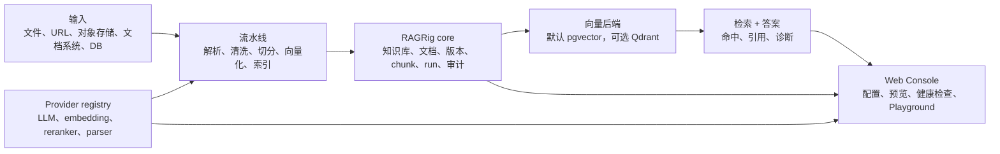

<p align="center">
  
</p>

<h1 align="center">RAGRig 源栈</h1>

<p align="center">
  <strong>面向可追溯、模型可用知识流水线的开源 RAG 工作台。</strong>
</p>

<p align="center">
  <a href="./README.md">English</a>
</p>

---

## 项目定位

RAGRig 是一个面向中小型团队的开源 RAG 工作台。

RAGRig 不是另一个“上传文件然后聊天”的壳子。它关注 RAG 真正难长期维护的工程层：入库、解析、清洗、chunk、embedding、索引、检索、答案引用、模型 Provider、评测和可追溯性。

## 优势特点

- **本地优先：** 默认从本地文件、Postgres/pgvector、Ollama、LM Studio、BGE、自托管 OpenAI-compatible runtime 开始。
- **云端兼容：** 支持 OpenAI、OpenRouter、Gemini 等主流入口，Vertex AI、Bedrock 等先进入模型目录和 roadmap。
- **全链路可追溯：** 答案能回到 source URI、文档版本、chunk、pipeline run 和模型诊断。
- **模型可插拔：** LLM、embedding、reranker、OCR、parser 都走清晰的 Provider Registry。
- **向量库可迁移：** 默认 pgvector，Qdrant 可选。
- **流水线可观察：** 解析、清洗、切分、向量化、索引、重排都能被检查，而不是藏在聊天框后面。
- **插件化扩展：** source、sink、model、vector backend、parser、preview、workflow node 都可通过插件扩展。
- **质量门禁：** 核心模块目标 100% 测试覆盖；云端和企业插件通过 contract test 与显式 live smoke 验证。

## 架构图



## 技术栈

| 层级 | 当前 / 默认 | 可选 / Roadmap |
| --- | --- | --- |
| App/API | Python、FastAPI | MCP / export surface |
| Web Console | FastAPI 内置轻量 Console | 更完整的 workflow UI |
| 元数据数据库 | PostgreSQL | SQLite 用于 smoke/test |
| 向量后端 | pgvector | Qdrant |
| 本地模型 | Ollama、LM Studio、OpenAI-compatible endpoint | vLLM、llama.cpp、Xinference、LocalAI |
| 云端模型 | OpenAI、OpenRouter、Gemini | Vertex AI、Bedrock、Azure OpenAI、Anthropic 等目录项 |
| 输入源 | 本地文件、Markdown/TXT、S3-compatible source | PDF/DOCX 上传、URL、企业连接器 |
| 质量验证 | pytest、coverage、contract tests | 显式 opt-in live provider smoke |

## Roadmap

### Local Pilot

下一阶段 roadmap 里先做简单本地试点。它是平台演进的一环，不是项目定位本身。

目标用户路径：

1. 启动本地栈。
2. 打开 Web Console。
3. 创建知识库。
4. 上传 Markdown、TXT、PDF、DOCX，或导入单网页 URL、sitemap、docs 页面列表。
5. 选择模型 Provider。
6. 运行入库和索引。
7. 在 Playground 提问，并检查答案引用、检索命中、chunk 和模型诊断。

范围和验收条件见 [Local Pilot spec](./docs/specs/ragrig-local-pilot-spec.md)。

### 后续里程碑

- 更完整的 Web Console workflow 管理
- 高级 PDF/DOCX/OCR 解析
- 更丰富的 source 和 sink 插件
- evaluation dashboard 与回归质量门
- 企业权限、审计和连接器加固

## Web Console

Web Console 是 RAGRig 的主要操作界面。第一版形态：

- 知识库列表
- source 配置与入库任务
- 模型配置和健康检查
- pipeline run 历史
- 文档和 chunk 预览
- 检索与答案 Playground
- 健康检查和数据库/向量状态

原型图：

<p align="center">
  
</p>

## 快速部署

安装依赖：

```bash
make sync
```

创建本地环境文件：

```bash
cp .env.example .env
```

启动数据库并执行 migration：

```bash
docker compose up --build -d db
make migrate
make db-check
```

运行当前本地入库和索引 smoke：

```bash
make ingest-local
make index-local
make retrieve-check QUERY="RAGRig Guide"
```

运行 Local Pilot API smoke：

```bash
make local-pilot-smoke
```

启动 Web Console：

```bash
make run-web
```

打开：

```text
http://localhost:8000/console
```

如果宿主机的 `8000` 或 `5432` 已被占用，可以在 `.env` 里改端口：

```bash
APP_HOST_PORT=18000
DB_HOST_PORT=15433
```

可选 Qdrant 路径：

```bash
docker compose --profile qdrant up -d qdrant
uv sync --extra vectorstores
VECTOR_BACKEND=qdrant make index-local
VECTOR_BACKEND=qdrant make retrieve-check QUERY="RAGRig Guide"
```

## 验证

默认检查：

```bash
make format
make lint
make test
make coverage
make web-check
make local-pilot-smoke
make dependency-inventory
```

供应链检查：

```bash
make licenses
make sbom
make audit
```

`make audit` 需要网络访问漏洞服务。离线环境请改跑 `make audit-dry-run`，并把缺失的 live audit 记录为发布 blocker。

## 文档

核心文档：

- [Local Pilot spec](./docs/specs/ragrig-local-pilot-spec.md)
- [MVP spec](./docs/specs/ragrig-mvp-spec.md)
- [Web Console spec](./docs/specs/ragrig-web-console-spec.md)
- [插件/数据源向导 spec](./docs/specs/ragrig-web-console-plugin-source-wizard-spec.md)
- [本地优先、质量与供应链策略](./docs/specs/ragrig-local-first-quality-supply-chain-policy.md)
- [核心覆盖率与供应链门禁](./docs/specs/ragrig-core-coverage-supply-chain-gates.md)

运维文档：

- [Dependency inventory](./docs/operations/dependency-inventory.md)
- [Supply chain](./docs/operations/supply-chain.md)
- [Roadmap](./docs/roadmap.md)

## 仓库结构

```text
.
├── assets/             # 项目图标
├── docs/               # 规格、运维文档、原型图
├── scripts/            # smoke、运维、验证命令
├── src/ragrig/         # RAGRig 应用代码
├── tests/              # 单元测试和 contract tests
├── docker-compose.yml  # 本地 Postgres/pgvector 与可选服务
├── pyproject.toml      # Python 依赖和工具配置
└── Makefile            # 常用开发命令
```

## License

RAGRig 使用 Apache License 2.0。详见 [LICENSE](./LICENSE)。
