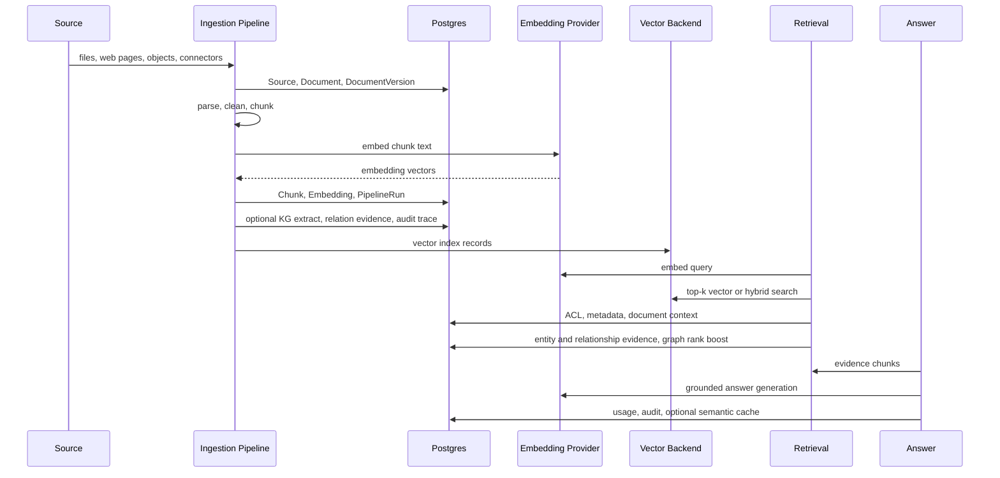

# RAGRig Architecture

This is the top-level map for new contributors. It explains how the active
runtime fits together and points to the small set of specs worth reading first.
See [Stage-specific Model Policy](specs/stage-model-policy.md) for KB-level provider/model
selection, compatibility priority, public trace, and secret handling.

## System Shape

```mermaid
flowchart LR
    user["User / agent"]
    console["React Web Console\nfrontend/"]
    api["FastAPI app\nsrc/ragrig/main.py"]
    routers["Routers\nsrc/ragrig/routers/"]
    services["Services\nanswer, retrieval, ingestion, tasks"]
    db["Postgres metadata DB\nSQLAlchemy models"]
    vectors["Vector backend\npgvector default, Qdrant optional"]
    providers["Provider registry\nLLM, embedding, reranker, parser"]
    graph["Postgres Graph-RAG\nentities, relations, claims, evidence"]
    workers["Task runtime\nthreadpool default, ARQ optional"]

    user --> console
    user --> api
    console --> api
    api --> routers
    routers --> services
    services --> db
    services --> vectors
    services --> providers
    services --> graph
    graph --> db
    services --> workers
```

RAGRig is a Python FastAPI service with a React console served by the same app.
Postgres stores metadata and, by default, pgvector embeddings. Provider code
adapts local and cloud model APIs behind shared embedding, rerank, and
generation contracts.

## Primary Entry Points

- `src/ragrig/main.py` creates the FastAPI app and wires routers.
- `frontend/` is the production React console.
- `Dockerfile` builds the console first, then copies compiled assets into the
  Python image.
- `docker-compose.yml` runs the app with Postgres + pgvector for local trials.
- `Makefile` collects development, smoke, verification, and demo commands.

The legacy HTML prototype lives at
`docs/prototypes/legacy-web-console/web_console.html`. The production UI is
React, but `src/ragrig/web_console.py` remains an active backend workflow facade
used by routers, tasks, services, and tests.

## Data Lifecycle



The core invariant is traceability. A grounded answer should be explainable from
answer text back to citation, chunk, document version, source, and pipeline run.
Graph rows never replace citations: expanded evidence must pass the same
workspace/RBAC/ACL and latest-version checks before reranking or answering.

## FastAPI Module Map

Routers are intentionally thin request boundaries. Shared behavior belongs in
services, repositories, providers, or pipeline modules.

| Area | Router / Module | Responsibility |
| --- | --- | --- |
| Auth and teams | `routers/auth.py`, `services/auth.py` | Sessions, API keys, MFA, LDAP/OIDC adapters, workspace members |
| Knowledge bases | `routers/knowledge.py`, `services/knowledge.py` | KB metadata, document and graph views, understanding exports |
| Ingestion | `routers/knowledge_ingest.py`, `routers/sources_pipeline.py` | Uploads, sources, pipeline runs, retry operations |
| Retrieval | `routers/retrieval_api.py`, `retrieval.py` | Search, answer entrypoint, permissions preview |
| Answers | `answer/` | Provider selection, citation grounding, semantic cache, faithfulness checks |
| Providers | `providers/` | Local/cloud LLMs, embedders, rerankers, provider registry |
| Vector stores | `vectorstore/` | pgvector and optional Qdrant backends |
| Operations | `routers/admin.py`, `routers/system.py`, `routers/retention.py` | Health, backup/restore, retention, diagnostics |
| Integration APIs | `routers/openai_compat.py`, `routers/mcp.py` | OpenAI-compatible chat/models and HTTP MCP JSON-RPC |
| Frontend serving | `routers/frontend.py` | Serves built React assets and root redirects |

## Request Lifecycle

1. A browser, SDK, or agent sends a request to FastAPI.
2. Middleware applies logging, request context, optional CORS, and auth
   dependencies.
3. The router validates request shape and resolves dependencies such as
   `Session`, `Settings`, and `AuthContext`.
4. A service or core module performs the business operation.
5. Repositories and SQLAlchemy models persist state.
6. Provider adapters call model, embedding, rerank, or parser backends.
7. Observability helpers emit structured logs, metrics, usage, and audit events.
8. The router returns JSON, streaming SSE, or static frontend assets.

## Runtime Boundaries

- **MCP:** `POST /mcp` is HTTP JSON-RPC request/response only. It does not
  implement bidirectional streaming transport.
- **Rate limiting:** `src/ragrig/ratelimit.py` uses process-local
  sliding-window counters and is suitable for a single process. Multi-worker or
  replicated deployments need an external shared limiter, such as an API gateway
  policy or Redis-backed limiter. ARQ/Redis task execution does not share API
  request limiter state.
- **Task execution:** `threadpool` is the default local backend. ARQ/Redis is
  optional for queue-backed execution.
- **Auth:** Local demos can disable auth; exposed deployments should enable auth
  and set a strong `RAGRIG_AUTH_SECRET_PEPPER`.
- **Coverage:** Coverage includes the FastAPI app entrypoint. It still omits
  the active `web_console.py` backend facade, so treat the percentage as a
  useful signal, not the whole risk picture.

## Terms

| Term | Meaning |
| --- | --- |
| Workspace | Multi-tenant boundary for users, KBs, API keys, usage, and ACLs |
| Knowledge base | A named corpus that groups sources, documents, chunks, and retrieval settings |
| Source | A configured ingestion origin such as local files, object storage, DB, or web |
| Document version | Immutable content snapshot used for traceable chunking and citations |
| Chunk | Searchable text unit derived from a document version |
| Chunk template | Versioned strategy contract that records parameters, split rules, and limitations |
| Embedding | Vector representation for a chunk or query |
| Pipeline run | Auditable execution record for ingestion, parsing, chunking, embedding, and indexing |
| Provider | Adapter for a model, embedding service, reranker, or local deterministic fallback |
| Semantic cache | Optional cache of grounded answers keyed by query embedding similarity |

## Read These Specs First

Start here before browsing all of `docs/specs/`:

- [MVP scope](./specs/ragrig-mvp-spec.md)
- [Metadata database](./specs/ragrig-phase-1a-metadata-db-spec.md)
- [Chunking and embedding](./specs/ragrig-phase-1c-chunking-embedding-spec.md)
- [Explainable chunking P0](./specs/ragrig-explainable-chunking-p0.md)
- [Retrieval API](./specs/ragrig-phase-1d-retrieval-api-spec.md)
- [Web Console](./specs/ragrig-web-console-spec.md)
- [Vercel Preview + Supabase](./specs/EVI-130-vercel-preview-supabase.md)

## Where To Go Next

- First run: [Getting started](./getting-started.md)
- Adding connectors/providers/parsers: [Extension tutorial](./development/extensions.md)
- Verification commands: [Operations verification](./operations/verification.md)
- Durable decisions: [Architecture Decision Records](./adr/README.md)
- Spec index: [Specs README](./specs/README.md)
