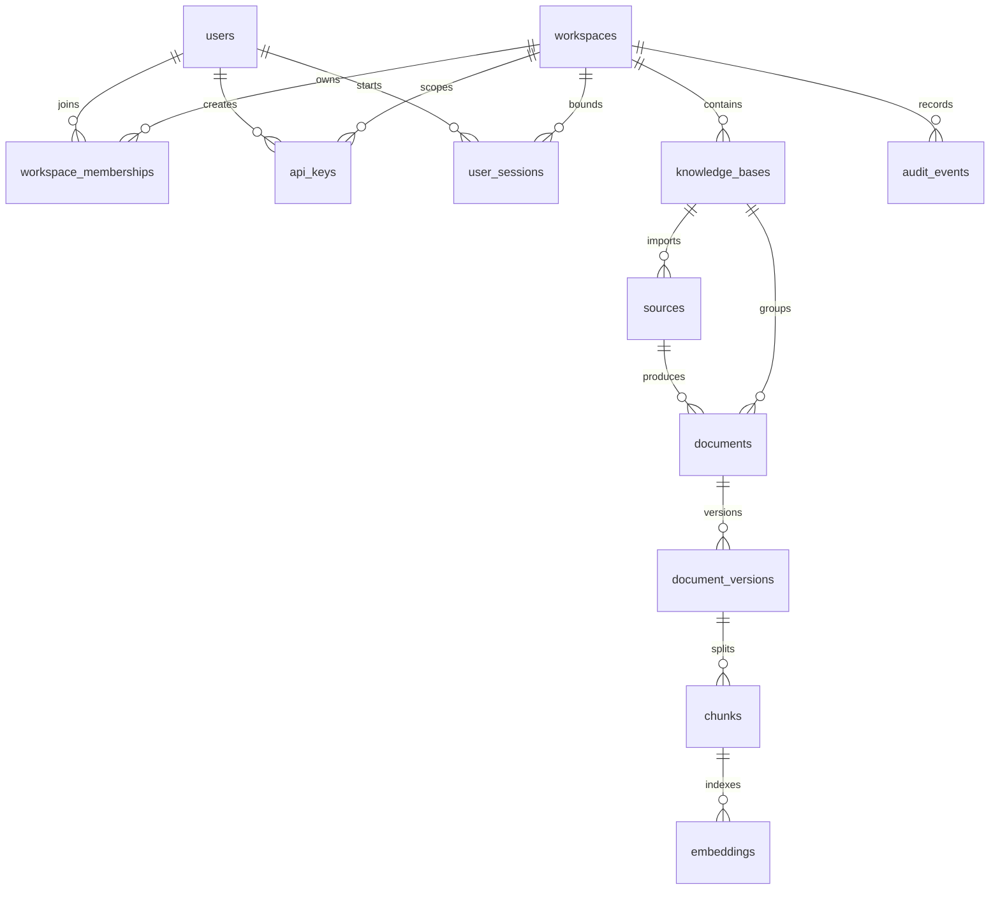

# Multi-tenant data model and authentication boundary

Status: design proposal only. This document intentionally does not change code,
SQLAlchemy models, repositories, Alembic migrations, or frontend behavior.

The current ragrig metadata graph is single-tenant: `knowledge_bases` owns
`sources`, `documents`, `pipeline_runs`, and `understanding_runs`; `documents`
own `document_versions`; `document_versions` own `chunks`; `chunks` own
`embeddings`; `audit_events` can reference knowledge bases, documents, chunks,
runs, and run items. ACL is enforced later by `src/ragrig/acl.py`, where
`Principal` expands request subjects to `user:<id>` and `group:<id>`, and
`AclMetadata` reads `metadata_json.acl.allowed_principals` /
`denied_principals` from documents, document versions, and chunks.

The recommended direction is to add a durable tenant boundary first, then layer
users, membership, API keys, and sessions on top of that boundary. The tenant
concept should be named `workspace_id` in tables because it matches team
collaboration language and avoids confusing it with the platform workspace id.
In application code and documentation, `workspace_id` is the tenant id.

## 租户隔离层

Recommendation: introduce a first-class `workspaces` table and add
`workspace_id UUID NOT NULL` to root and high-volume query tables. The invariant
is "every user-visible object belongs to exactly one workspace". `knowledge_bases`
becomes unique by `(workspace_id, name)` instead of globally unique by `name`.
Child tables that already have an unambiguous parent path can derive workspace
through joins, but high-volume or externally addressed tables should also carry
`workspace_id` to make filtering cheap and to reduce accidental cross-tenant
joins.

New table:

| Table | Field | Type | Constraints / indexes |
| --- | --- | --- | --- |
| `workspaces` | `id` | `UUID` | primary key |
| `workspaces` | `slug` | `String(255)` | `UNIQUE`, not null, normalized lowercase |
| `workspaces` | `display_name` | `String(255)` | not null |
| `workspaces` | `status` | `String(32)` | not null, default `active`; values `active`, `suspended`, `deleted` |
| `workspaces` | `metadata_json` | `JSONB` | not null, default `{}` |
| `workspaces` | `created_at`, `updated_at` | `DateTime(timezone=True)` | not null |

Recommended schema changes for existing core tables:

| Table | Field | Type | Constraints / indexes |
| --- | --- | --- | --- |
| `knowledge_bases` | `workspace_id` | `UUID` | `NOT NULL`, FK `workspaces.id ON DELETE CASCADE`, index `ix_knowledge_bases_workspace_id` |
| `knowledge_bases` | `name` | `String(255)` | replace global `UNIQUE(name)` with `UNIQUE(workspace_id, name)` named `uq_knowledge_bases_workspace_name` |
| `sources` | `workspace_id` | `UUID` | `NOT NULL`, FK `workspaces.id ON DELETE CASCADE`, index `ix_sources_workspace_id`; composite FK `(workspace_id, knowledge_base_id)` to `knowledge_bases(workspace_id, id)` |
| `sources` | `uri` | `Text` | replace `UNIQUE(knowledge_base_id, uri)` with `UNIQUE(workspace_id, knowledge_base_id, uri)` |
| `documents` | `workspace_id` | `UUID` | `NOT NULL`, FK `workspaces.id ON DELETE CASCADE`, index `ix_documents_workspace_id`; composite FK `(workspace_id, knowledge_base_id)` to `knowledge_bases(workspace_id, id)` |
| `documents` | `uri` | `Text` | replace `UNIQUE(knowledge_base_id, uri)` with `UNIQUE(workspace_id, knowledge_base_id, uri)` |
| `document_versions` | `workspace_id` | `UUID` | `NOT NULL`, FK `workspaces.id ON DELETE CASCADE`, index `ix_document_versions_workspace_id`; composite FK `(workspace_id, document_id)` to `documents(workspace_id, id)` |
| `chunks` | `workspace_id` | `UUID` | `NOT NULL`, FK `workspaces.id ON DELETE CASCADE`, index `ix_chunks_workspace_id`; composite FK `(workspace_id, document_version_id)` to `document_versions(workspace_id, id)` |
| `embeddings` | `workspace_id` | `UUID` | `NOT NULL`, FK `workspaces.id ON DELETE CASCADE`, index `ix_embeddings_workspace_id`; composite FK `(workspace_id, chunk_id)` to `chunks(workspace_id, id)` |

The explicit `workspace_id` on `chunks` and `embeddings` is intentional even
though it duplicates parent data. Retrieval and vector synchronization are hot
paths. They must be able to add `WHERE workspace_id = :workspace_id` before
candidate expansion, lexical fusion, reranking, answer generation, and audit
logging. This column also lets vector backends store tenant payloads and perform
delete-by-workspace operations without walking the whole relational graph.

Recommended ER fragment:

## API Key 模型

Recommendation: API keys are workspace-scoped credentials owned by a user or a
service account. They should never be stored in plaintext. The issued secret can
look like `rag_live_<public_prefix>_<secret>`, but the database stores only a
short public prefix for lookup and a slow or keyed hash for verification.

New tables:

| Table | Field | Type | Constraints / indexes |
| --- | --- | --- | --- |
| `users` | `id` | `UUID` | primary key |
| `users` | `email` | `String(320)` | unique nullable if local-only deployments do not require email |
| `users` | `display_name` | `String(255)` | nullable |
| `users` | `status` | `String(32)` | not null, default `active` |
| `users` | `created_at`, `updated_at` | `DateTime(timezone=True)` | not null |
| `workspace_memberships` | `workspace_id` | `UUID` | FK `workspaces.id ON DELETE CASCADE`, part of unique key |
| `workspace_memberships` | `user_id` | `UUID` | FK `users.id ON DELETE CASCADE`, part of unique key |
| `workspace_memberships` | `role` | `String(32)` | not null; values `owner`, `admin`, `editor`, `viewer` |
| `workspace_memberships` | `group_ids` | `JSONB` | not null, default `[]`; stores normalized group ids until groups become first-class |
| `workspace_memberships` | `status` | `String(32)` | not null, default `active` |
| `workspace_memberships` | indexes | - | `UNIQUE(workspace_id, user_id)`, `ix_memberships_user_id`, `ix_memberships_workspace_role` |
| `api_keys` | `id` | `UUID` | primary key |
| `api_keys` | `workspace_id` | `UUID` | FK `workspaces.id ON DELETE CASCADE`, not null, index `ix_api_keys_workspace_id` |
| `api_keys` | `created_by_user_id` | `UUID` | FK `users.id ON DELETE SET NULL`, nullable for bootstrap/system keys |
| `api_keys` | `name` | `String(255)` | not null |
| `api_keys` | `prefix` | `String(24)` | not null, unique, lookup-only public key prefix |
| `api_keys` | `secret_hash` | `String(255)` | not null; Argon2id PHC string for user-generated keys, or HMAC-SHA-256 with server pepper for high-throughput service keys |
| `api_keys` | `scopes` | `JSONB` | not null, default `[]`; examples below |
| `api_keys` | `principal_user_id` | `String(255)` | nullable subject injected as `user:<value>` for service-style keys |
| `api_keys` | `principal_group_ids` | `JSONB` | not null, default `[]`, injected as `group:<value>` |
| `api_keys` | `last_used_at` | `DateTime(timezone=True)` | nullable |
| `api_keys` | `expires_at` | `DateTime(timezone=True)` | nullable |
| `api_keys` | `revoked_at` | `DateTime(timezone=True)` | nullable; index `ix_api_keys_revoked_at` |
| `api_keys` | `created_at`, `updated_at` | `DateTime(timezone=True)` | not null |

Scope examples should be simple strings at first:

- `kb:read`, `kb:write`
- `source:read`, `source:write`
- `document:read`, `document:write`
- `retrieval:search`, `retrieval:answer`
- `acl:read`, `acl:write`
- `admin:audit`

API key authorization has two layers. First, the key must be active, unexpired,
unrevoked, and allowed for the workspace plus route scope. Second, it creates a
Principal context for existing ACL filtering. For user-owned keys, the request
principal is `Principal(user_id=<users.id>, group_ids=<membership.group_ids>)`.
For service keys, the explicit `principal_user_id` and `principal_group_ids`
fields provide stable subjects such as `user:svc-ingest` and
`group:engineering`. This lets `AclMetadata.allowed_principals` and
`denied_principals` continue to work without immediate changes to chunk ACL
evaluation.

Hashing details:

- User-created long-lived keys: store `argon2id` PHC strings with memory and
  time costs set by deployment config. This protects leaked DB backups.
- High-throughput machine keys: store `base64url(HMAC-SHA-256(server_pepper,
  raw_secret))` and rotate `server_pepper` through a versioned secret manager
  field such as `hash_version String(16)`. This is faster but makes the pepper
  a critical secret.
- Always compare hashes with constant-time comparison and log only `api_key_id`
  plus `prefix`, never the raw secret.

## 用户会话

Recommendation: use opaque, database-backed session tokens for first-party web
and local console flows, with optional short-lived JWT access tokens later only
for stateless edge deployments. The local-first product already depends on the
metadata database, and revocation/debuggability matter more than avoiding one
session lookup.

Proposed `user_sessions` table:

| Table | Field | Type | Constraints / indexes |
| --- | --- | --- | --- |
| `user_sessions` | `id` | `UUID` | primary key |
| `user_sessions` | `workspace_id` | `UUID` | FK `workspaces.id ON DELETE CASCADE`, not null, index `ix_user_sessions_workspace_id` |
| `user_sessions` | `user_id` | `UUID` | FK `users.id ON DELETE CASCADE`, not null, index `ix_user_sessions_user_id` |
| `user_sessions` | `token_hash` | `String(255)` | not null, unique; HMAC-SHA-256 or Argon2id hash of the opaque token |
| `user_sessions` | `scopes` | `JSONB` | not null, default `[]`; usually derived from membership role |
| `user_sessions` | `ip_hash` | `String(128)` | nullable privacy-preserving audit aid |
| `user_sessions` | `user_agent_hash` | `String(128)` | nullable |
| `user_sessions` | `created_at` | `DateTime(timezone=True)` | not null |
| `user_sessions` | `last_seen_at` | `DateTime(timezone=True)` | nullable |
| `user_sessions` | `expires_at` | `DateTime(timezone=True)` | not null, index `ix_user_sessions_expires_at` |
| `user_sessions` | `revoked_at` | `DateTime(timezone=True)` | nullable, index `ix_user_sessions_revoked_at` |

JWT vs session token comparison:

| Dimension | JWT | Opaque session token |
| --- | --- | --- |
| Security and revocation | Self-contained claims are easy to validate but hard to revoke before expiration unless a denylist is added. Key rotation and stale group claims need careful handling. | Server checks `user_sessions`, so revocation, expiration, role changes, and workspace suspension take effect immediately. A leaked DB still does not expose raw tokens if only hashes are stored. |
| Horizontal scaling | Stateless validation is simple across workers and regions, assuming signing keys are distributed safely. | Requires shared DB or cache lookup. ragrig already uses a metadata DB, so the operational cost is acceptable for the first team-collaboration milestone. |
| Implementation complexity | Requires claim design, signing key management, issuer/audience validation, clock skew handling, and refresh-token strategy. | Requires token generation, hash lookup, expiration cleanup, and indexes. This is simpler and more observable in a local-first app. |
| Auditability | Request logs can include token subject claims, but historical investigation depends on retained JWT ids or logs. | Each request can point to `user_sessions.id`, membership, and revocation state. |
| ACL freshness | Group claims embedded in JWT can go stale until token refresh. | Principal group ids are loaded from current `workspace_memberships`, so ACL decisions reflect recent membership changes. |

The recommended session request principal is assembled per request from
`user_sessions.user_id`, `workspace_memberships.role`, and
`workspace_memberships.group_ids`. The caller may have broad route scopes but
still be denied by chunk-level ACL when `AclMetadata` does not permit the
principal subjects.

## 迁移影响评估

Migration should happen in two phases. First add nullable columns and a default
workspace row for existing local data. Backfill all rows by walking existing
foreign keys from `knowledge_bases`. Then make `workspace_id` not null, add
composite unique constraints, and update repositories/API queries to require an
explicit workspace context. The table below lists the currently affected tables
and a conservative complexity estimate.

| Table | Change summary | Index / constraint changes | Complexity |
| --- | --- | --- | --- |
| `knowledge_bases` | Add `workspace_id UUID`; backfill all existing rows to a default workspace; replace global unique `name`. | Add `ix_knowledge_bases_workspace_id`, `UNIQUE(workspace_id, id)`, `UNIQUE(workspace_id, name)`; drop `UNIQUE(name)`. | Medium |
| `sources` | Add `workspace_id UUID`; backfill from parent knowledge base; ensure source cannot point across workspaces. | Add `ix_sources_workspace_id`, `UNIQUE(workspace_id, knowledge_base_id, id)`, `UNIQUE(workspace_id, knowledge_base_id, uri)`, composite FK to knowledge base. | Medium |
| `documents` | Add `workspace_id UUID`; backfill from knowledge base; keep source and document workspace aligned. | Add `ix_documents_workspace_id`, `UNIQUE(workspace_id, knowledge_base_id, uri)`, `UNIQUE(workspace_id, id)`, composite FKs to knowledge base and source. | Medium |
| `document_versions` | Add `workspace_id UUID`; backfill through document; include workspace in joins and cleanup. | Add `ix_document_versions_workspace_id`, `UNIQUE(workspace_id, document_id, version_number)`, `UNIQUE(workspace_id, id)`, composite FK to document. | Medium |
| `chunks` | Add `workspace_id UUID`; backfill through document version; update retrieval queries and vector payload creation. | Add `ix_chunks_workspace_id`, optionally `ix_chunks_workspace_doc_version`, `UNIQUE(workspace_id, document_version_id, chunk_index)`, `UNIQUE(workspace_id, id)`. | High |
| `embeddings` | Add `workspace_id UUID`; backfill through chunk; update pgvector and Qdrant upsert/delete/search payloads to filter by workspace. | Add `ix_embeddings_workspace_id`, `ix_embeddings_workspace_provider_model`, composite FK `(workspace_id, chunk_id)` to chunks. | High |
| `audit_events` | Add nullable or not-null `workspace_id UUID`; for historical events backfill from referenced knowledge base/document/chunk/run where possible, else default workspace. | Add `ix_audit_events_workspace_occurred_at`, `ix_audit_events_workspace_event_type`; FK `workspaces.id ON DELETE SET NULL` if retaining audit after workspace deletion. | Medium |
| `pipeline_runs` | Add `workspace_id UUID`; backfill from knowledge base; prevent source/run cross-workspace references. | Add `ix_pipeline_runs_workspace_started_at`, composite FKs to knowledge base/source. | Medium |
| `pipeline_run_items` | Add `workspace_id UUID`; backfill from run or document; keep run/document aligned. | Add `ix_pipeline_run_items_workspace_id`, `UNIQUE(workspace_id, pipeline_run_id, document_id)`. | Medium |
| `document_understandings` | Add `workspace_id UUID`; backfill through document version; keep profile outputs tenant-scoped. | Add `ix_document_understandings_workspace_id`, `UNIQUE(workspace_id, document_version_id, profile_id)`. | Low |
| `understanding_runs` | Add `workspace_id UUID`; backfill from knowledge base. | Add `ix_understanding_runs_workspace_started_at`; composite FK to knowledge base. | Low |
| `processing_profile_overrides` | Decide whether profiles are global or workspace-specific. Recommendation: keep built-in profile ids global but allow nullable `workspace_id` for overrides. | Add partial unique indexes: global `profile_id WHERE workspace_id IS NULL`; workspace `UNIQUE(workspace_id, profile_id)`. | Medium |
| `processing_profile_audit_log` | Add nullable `workspace_id UUID` if profile overrides become tenant-aware. | Add `ix_processing_profile_audit_workspace_timestamp`. | Low |
| `task_records` | Add nullable `workspace_id UUID` for async jobs that touch tenant data. | Add `ix_task_records_workspace_status`. | Low |

The risky part is not adding columns; it is changing every read path so
workspace context is mandatory. Retrieval, answer generation, permission
preview, web console lists, export jobs, backup/restore scripts, and vector
backend synchronization must all reject requests without a workspace context
once enforcement is enabled.

## 与现有 ACL 的衔接

`acl.py` should not need an immediate behavioral rewrite. The current
`Principal` and `AclMetadata` design can represent users and groups from the
new model if the authentication layer supplies normalized subjects. The
alignment rule is:

- Workspace membership establishes the coarse boundary: a caller cannot access
  any `knowledge_bases`, `documents`, `chunks`, `embeddings`, or audit rows
  outside `request.workspace_id`.
- `AclMetadata.allowed_principals` and `denied_principals` remain the fine
  boundary inside that workspace.
- `users.id` maps to `user:<uuid>`; a stable external account id can be stored
  as an additional principal only if compatibility requires it.
- `workspace_memberships.group_ids` maps to `group:<group_id>` values.
- Service API keys map to `user:<principal_user_id>` and
  `group:<principal_group_ids[]>`.

The ACL evaluation sequence should become:

1. Resolve authentication: session token or API key.
2. Resolve workspace: URL, header, or selected session workspace.
3. Check workspace membership or API key workspace binding.
4. Check route scope such as `document:read` or `retrieval:search`.
5. Query only rows with matching `workspace_id`.
6. Pass principal subjects to existing `AclMetadata.permits()` and
   `acl_explain_reason()`.

This design means `acl.py` does not need to know about database workspaces for
the first implementation phase. It remains a pure principal-list evaluator.
Future optional changes may improve typing and namespace clarity:

| Possible `acl.py` change | Required now? | Reason |
| --- | --- | --- |
| Add `workspace_id` to `Principal` | No | Workspace filtering should happen before ACL evaluation, in request context and repositories. |
| Add stricter `Subject` value object for `user:` / `group:` strings | No | Useful for validation later, but current `normalize_principal_ids()` preserves backward compatibility. |
| Deprecate bare user ids | Not immediately | Existing fixtures and integrations may rely on bare ids. Continue accepting them, but write new ACL metadata with prefixed subjects. |
| Add `role:<role>` principal subjects | Optional | Could allow role-based ACL such as `role:viewer`, but route scopes and membership roles usually cover this better. |

One important policy decision: tenant isolation must not be expressed as
`allowed_principals=["workspace:<id>"]` inside chunk metadata. Tenant isolation
belongs in relational schema constraints and query predicates. ACL metadata is
for exceptions and source-derived document permissions within an already
selected workspace. Keeping these boundaries separate avoids a class of bugs
where a public chunk in one workspace becomes visible to another workspace
because it has `visibility: public`.

## Alternative approaches

| Alternative | Pros | Cons | Recommendation |
| --- | --- | --- | --- |
| Add `workspace_id` only to `knowledge_bases` and derive all children through joins | Smallest migration; fewer duplicated columns; easiest SQLAlchemy model change. | Retrieval, audit, vector cleanup, and exports need deeper joins; harder to enforce in every hot query; higher risk of accidental cross-tenant reads. | Reject for long-term multi-tenant support. Accept only as a temporary phase during migration. |
| Add `workspace_id` to every tenant-owned table, including chunks and embeddings | Strong local predicates, easier repository filters, safer vector payloads, simpler audit and deletion operations. | More columns and composite constraints; more backfill work; higher migration complexity for high-volume tables. | Recommended. The cost is paid once and reduces future security risk. |
| Separate PostgreSQL schema or database per workspace | Strong isolation and simple per-tenant backup/restore; noisy tenant isolation is natural. | Operationally heavy for local-first deployments; migrations and cross-tenant admin operations become much harder; API keys/sessions still need global coordination. | Defer. Consider only for enterprise hosted deployments with strict isolation requirements. |
| Store all auth and tenant metadata in JSON fields | Very fast to prototype; no immediate FK or migration pressure. | Hard to index and validate; weak referential integrity; easy to miss filters; poor auditability. | Reject. This repeats the risk the design is meant to avoid. |

## Implementation sequencing

This issue does not implement the schema, but the eventual implementation should
be ordered to avoid breaking existing local users:

1. Add `workspaces`, `users`, `workspace_memberships`, `api_keys`, and
   `user_sessions` behind feature flags or unused code paths.
2. Add nullable `workspace_id` columns and indexes to tenant-owned existing
   tables.
3. Create a default workspace for current local deployments and backfill all
   existing rows.
4. Update repositories and API entrypoints to require workspace context while
   keeping a default workspace fallback for local pilot mode.
5. Backfill vector payloads or rebuild vector collections with workspace
   payload filters.
6. Make `workspace_id` not null and enforce composite uniqueness/FKs.
7. Remove compatibility fallback once multi-tenant mode is the default.

The central tradeoff is duplication versus security. Duplicating `workspace_id`
onto `chunks`, `embeddings`, and audit rows increases migration work, but it
lets every retrieval, vector, export, and audit query carry a simple tenant
predicate. That is the safer default for a system where chunk text and embeddings
may contain sensitive source material.
